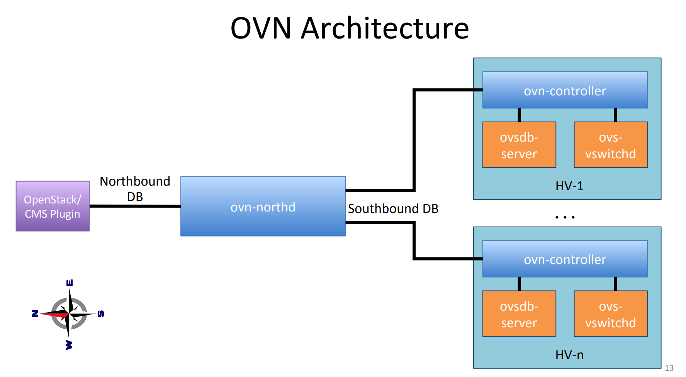
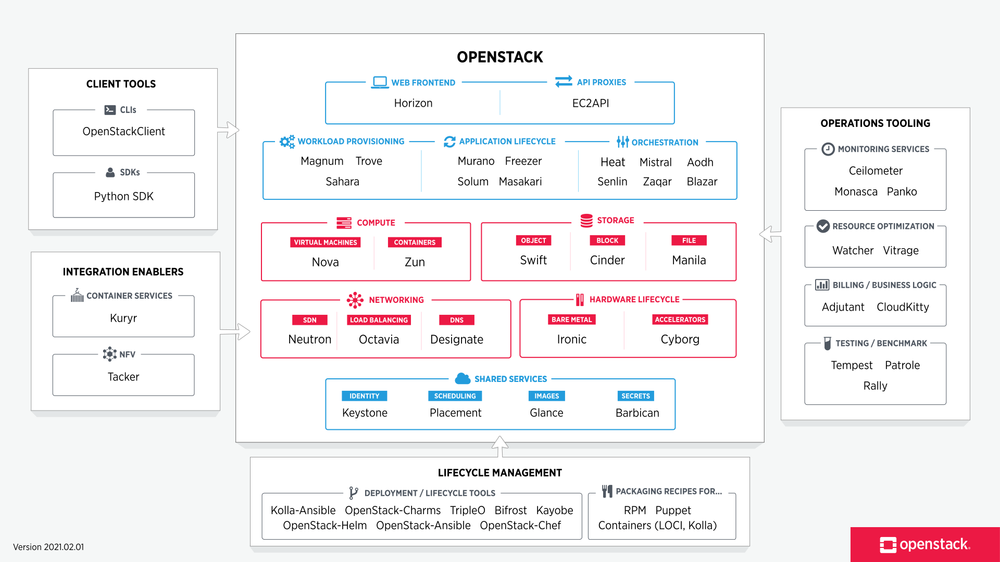

# 2021.05.03-2021.05.09调研总结
## 虚拟化技术
### Open vSwitch
一个基于Open vSwitch是一个基于开源Apache 2许可证的多层软件交换机。我们的目标是实现一个生产质量的交换机平台，该平台支持标准的管理接口，并将转发功能开放给编程扩展和控制。  
Open vSwitch非常适合作为虚拟机环境中的虚拟交换机。除了向虚拟网络层公开标准控制和可见性接口之外，它还被设计为支持跨多个物理服务器分发。Open vSwitch支持多种linux虚拟化技术，包括Xen/XenServer、KVM、VirtualBox等。   
大部分代码是用独立于平台的C语言编写的，很容易移植到其他环境中。 Open vSwitch也可以完全在用户空间中操作，而不需要内核模块的帮助。这种用户空间实现应该比基于内核的交换机更容易移植。用户空间中的OVS可以访问Linux或DPDK设备。说明使用userspace datapath和非DPDK设备打开vSwitch被认为是实验性的，会带来性能成本。  
这一分布的主要组成部分是:  
* ovs-vswitchd，一个实现交换机的守护进程，以及一个用于基于流的交换机的配套Linux内核模块。  
* ovsdb-server，轻量级数据库服务器，ovs-vswitchd通过查询获取配置信息。  
* ovs-dpctl，用于配置交换内核模块的工具。  
* 为Citrix XenServer和Red Hat Enterprise Linux构建rpm的脚本和规范。XenServer rpm允许将Open vSwitch安装在Citrix XenServer主机上，作为switch的临时替代品，并提供额外的功能。  
* ovs-vsctl,一个用于查询和更新ovs-vswitchd配置的实用程序。
* ovs-appctl，一个实用程序，发送命令到运行打开的vSwitch守护进程。
Open vSwitch还提供了一些工具:
* ovs-ofctl，一个用于查询和控制OpenFlow开关和控制器的实用程序。
* ovs-pki，一个用于创建和管理OpenFlow交换机的公钥基础设施的实用程序。
* ovs-testcontroller，一个简单的OpenFlow控制器，可能对测试有用(但对生产不有用)。
* tcpdump的补丁，使其能够解析OpenFlow消息。 
[What Is Open vSwitch?](https://docs.openvswitch.org/en/latest/intro/what-is-ovs/)
特点：
* Open vSwitch的目标是多服务器虚拟化部署，这是以前的堆栈不太适合的场景。这些环境的特点通常是高度动态的端点、逻辑抽象的维护，以及(有时)集成或卸载到特殊用途的交换硬件。  
* 虚拟环境变化速度快，虚拟机随逻辑网络环境的变化而变化。Open vSwitch支持许多特性，允许网络控制系统响应和适应环境的变化。这包括简单的会计和可见性支持，如NetFlow、IPFIX和sFlow。但是更有用的是，Open vSwitch支持支持远程触发器的网络状态数据库(OVSDB)。
* Open vSwitch也支持OpenFlow作为导出远程访问控制流量的方法。这种方法有很多用途，包括通过检查发现或链路状态流量(例如LLDP、CDP、OSPF等)进行全局网络发现。
* 逻辑标记：ovs使用优化的标记规则/隧道，使得远程配置非常方便。分布式虚拟交换机(如VMware vDS和Cisco的Nexus 1000V)通常通过在网络数据包中附加或操作标记来维护网络中的逻辑上下文。这可以用来唯一地标识VM(以一种抵抗硬件欺骗的方式)，或者保存一些只与逻辑域相关的其他上下文。构建分布式虚拟交换机的主要问题是有效和正确地管理这些标记。Open vSwitch包括用于指定和维护标记规则的多种方法，所有这些方法都可以被用于编制的远程流程访问。此外，在许多情况下，这些标记规则以一种优化的形式存储，因此它们不必与重量级的网络设备耦合。例如，这允许配置、更改和迁移数以千计的标记或地址重新映射规则。
同样，Open vSwitch支持GRE实现，可以同时处理数千条GRE隧道，并支持对隧道创建、配置和拆除的远程配置。例如，可以用于连接不同数据中心的私有虚拟机网络。
* 硬件集成：Open vSwitch的转发路径(内核内数据路径)被设计成能够将包处理“卸载”到硬件芯片组，无论是位于经典的硬件交换机箱还是终端主机网卡中。这允许打开的vSwitch控制路径能够同时控制一个纯软件实现或一个硬件开关。
* Open vSwitch在设计领域的目标与以前的管理程序网络栈不同，它关注的是大规模基于linux的虚拟化环境中对自动化和动态网络控制的需求。使用Open vSwitch的目标是使内核代码尽可能小(这是性能的需要)，并在适用时重用现有的子系统(例如，Open vSwitch使用现有的QoS堆栈)。从Linux 3.3开始，Open vSwitch作为内核的一部分被包含在内，用户空间实用程序的打包在大多数流行的发行版上都可以使用。
[Why Open vSwitch?](https://docs.openvswitch.org/en/latest/intro/why-ovs/#why-open-vswitch)    
### OVN
* [OVN](https://www.ovn.org/en/)
* [OVN:Open Virtual Network for Open vSwitch](http://www.openvswitch.org//support/slides/OVN-Vancouver.pdf)
* [交换机、路由器、网关的概念和用途](https://www.huaweicloud.com/articles/51b313f5ce75fcf27c6d99a0e8239c39.html)

### DPDK-Data Plane Development Kit
[Data Plane Development Kit](https://en.wikipedia.org/wiki/Data_Plane_Development_Kit)

定义：网络数据包转发处理软件库。  
* 设计为运行在x86, POWER和ARM处理器上，它主要运行在Linux用户领域，有一个FreeBSD端口可用于DPDK特性的子集。DPDK是在开源BSD许可证下许可的。可以下载最新的补丁和增强功能。  

背景：在x86结构中，处理封包的传统方式是CPU中断方式，即网卡驱动接收到封包后通过中断通知CPU处理，然后由CPU拷贝资料并交给协议栈，因此在资料量大时，会产生大量的CPU中断，导致CPU无法执行其他程序。  
而DPDK采用轮询方式实现封包处理过程：DPDK多载了网卡驱动，驱动在收到封包后不会中断通知CPU，而是将封包通过零拷贝技术存入记忆体，这时应用方程式就可以通过DPDK提供的界面，直接从记忆体中读取封包。因此，节省了CPU中断事件、记忆体拷贝事件，并向应用层提供了简单易行且高效的封包处理方式，使得网路应用的开发更加方便。但同时，由于需要多载网卡驱动，因此该开发包只能用在部分采用Intel网络处理晶片的网卡中。  

特点：
* 核心优化：PMD，Poll Mode Driver,主动轮询
* 在最小生命周期数内收发包
* 开发快速数据包捕获算法(类似tcpdump)
* 运行第三方快速路径栈
* DPDK不同于Linux系统以通用性设计为目的，而是专注于网络应用中数据包的高性能处理。具体体现在DPDK应用程序是运行在用户空间上利用自身提供的数据平面库来收发数据包，绕过了Linux内核协议栈对数据包处理过程。它不是一个用户可以直接建立应用程序的完整产品，不包含需要与控制层（包括内核和协议堆栈）进行交互的工具。因此。相比原生 Linux（Native Linux），采用Intel DPDK技术后能够大幅提升IPV4的转发性能，可以让用户在迁移包处理应用时（从基于NPU的硬件迁移到基于Intel x86的平台上），获得更好的成本和性能优势。同时可以采用统一的平台部署不同的服务，如应用处理，控制处理和包处理服务。

核心模块：
* 网络层模块
* 内存管理模块
* 内核管理模块

对比分析
DPDK对从内核层到用户层的网络流程相对传统网络模块进行了特殊处理，下面对传统网络模块结构和DPDK中的网络结构做对比。  

传统linux网络层:硬件中断--->取包分发至内核线程--->软件中断--->内核线程在协议栈中处理包--->处理完毕通知用户层用户层收包-->网络层--->逻辑层--->业务层

dpdk网络层:硬件中断--->放弃中断流程  用户层通过设备映射取包--->进入用户层协议栈--->逻辑层--->业务层

对比后总结:

dpdk优势:
* 减少了中断次数。
* 减少了内存拷贝次数。
* 绕过了linux的协议栈，进入用户协议栈，用户获得了协议栈的控制权，能够定制化协议栈降低复杂度

dpdk劣势
* 内核栈转移至用户层增加了开发成本.
* 低负荷服务器不实用，会造成内核空转.

### NFV-[Network function virtualization](https://en.wikipedia.org/wiki/Network_function_virtualization)，网络功能虚拟化

网络架构理念，将整个网络中的各个功能节点虚拟化，连接成一个可通信的模块。  
一个NFV可能包括一个或多个运行不同软件和进程的虚拟机或容器，相较传统的服务器虚拟化技术，NFC可能包括一个或多个运行不同软件和进程的虚拟机或容器，不需要硬件设备的支持，史构建在标准的高容量服务器、交换机和存储设备，甚至是云计算基础设施之上。  
* [会话边界控制器SBC](https://baike.baidu.com/item/%E4%BC%9A%E8%B0%88%E8%BE%B9%E7%95%8C%E6%8E%A7%E5%88%B6%E5%99%A8/22923493?fromtitle=SBC&fromid=23647938)，Session Border Controller,一种NAT穿透的方式。SBC可确保VoIP 安全，又可提供媒体代理服务器的套件。
### OpenFlow
* [OpenFlow-WIKIPEDIA](https://en.wikipedia.org/wiki/OpenFlow)
* [OpenFlow: Enabling Innovation in Campus Networks](http://ccr.sigcomm.org/online/files/p69-v38n2n-mckeown.pdf)
定义：基于TCP/IP提出的数据交换协议，将数据包的转发分为OpenFlow Switch和OpenFlow Controller分别独立完成，实现了控制层面和转层面的分离，控制器只负责转发规则，交换机只执行转发，且交换机和控制器通过Ip网络链接，可以不位于同一台主机上。

组成：
* OpenFlow交换机进行数据层的转发；
* FlowVisor对网络进行虚拟化；
* Controller对网络进行集中控制，实现控制层的功能，本地维护一份流表Flow Table,定义了数据包的传输路径。 

OpenFlow协议支持三种信息类型：
* 每一个类型都有多个子类型。
* a) Controller/Switch消息，是指由Controller发起、Switch接收并处理的消息，主要包括Features、Configuration、Modify-State、Read-State、Packet-out、Barrier和Role-Request等消息。这些消息主要由Controller用来对Switch进行状态查询和修改配置等操作。
* b) 异步(Asynchronous)消息，是由Switch发送给Controller、用来通知Switch上发生的某些异步事件的消息，主要包括Packet-in、Flow-Removed、Port-status和Error等。例如，当某一条规则因为超时而被删除时，Switch将自动发送一条Flow-Removed消息通知Controller，以方便Controller作出相应的操作，如重新设置相关规则等。
* c) 对称(Symmetric)消息，顾名思义，这些都是双向对称的消息，主要用来建立连接、检测对方是否在线等，包括Hello、Echo和Experimenter三种消息。
另外出于安全和高可用性等方面的考虑，OpenFlow的规范还规定了如何为Controller和Switch之间的信道加密、如何建立多连接等(主连接和辅助连接)。

OpenFlow交换机的分类
* 专用的OpenFlow交换机：它是专门为支持OpenFlow而设计的。它不支持现有的商用交换机上的正常处理流程，所有经过该交换机的数据都按照OpenFlow的模式进行转发。专用的OpenFlow交换机中不再具有控制逻辑，因此专用的OpenFlow交换机是用来在端口间转发数据包的一个简单的路径部件。
* 支持OpenFlow的交换机：它是在商业交换机的基础上添加流表、安全通道和OpenFlow协议来获得了OpenFlow特性的交换机。其既具有常用的商业交换机的转发模块，又具有OpenFlow的转发逻辑，因此支持OpenFlow的交换机可以采用两种不同的方式处理接收到的数据包。

### Ovs中的OpenFlow
* [云计算底层技术-openflow在OVS中的应用](https://opengers.github.io/openstack/openstack-base-openflow-in-openvswitch/)
Ovs可以使用OpenFlow Controller获取流表，也可以使用ovs-ofctl手动添加流表项。  
ovs是linux bridge一个很好的选择，支持多种flow，也可以同时维护多个流表，每个流表包括多个流表项，每条流表项包含多个匹配字段match fields以及匹配成功后要执行的指令集action set和统计信息。  
* 
* 真实的Switch硬件存储RIB和FIB，靠查询TCAM来匹配路由表项，Open vSwitch的话只能靠纯软件数据结构实现，没记错的话有哈希表实现的O(1)查找，还有链表实现的O(n)查找，路由表项都存储在内存里。
从协议扩展上来说，一般的硬件Switch对协议的解析流程都是固化的，当然好的交换机也可以通过后期的固件升级支持新的协议，而Open vSwitch只需要改代码就可以，可以适应快并且激烈的网络协议变化（比如OpenFlow）
### OpenStack,即ODL
* [OpenStack](https://www.openstack.org/)
* [OpenStack-Wikipedia](https://en.wikipedia.org/wiki/OpenStack)

开源的云计算管理平台项目，是一系列软件开源项目的组合。

### OpenDaylight
* [OpenDaylight](https://www.opendaylight.org/)
* [OpenDaylight Project-wikipedia](https://en.wikipedia.org/wiki/OpenDaylight_Project)
* [Installing OpenDaylight](https://docs.opendaylight.org/en/stable-carbon/getting-started-guide/installing_opendaylight.html)
Open Daylight是一个高度可用、模块化、可扩展、支持多协议的控制器平台,可以作为SDN管理平面管理多厂商异构的SDN网络.基于Karaf容器.

* SDN的一种实现方式

### SDN（Software Defined Network）
　　基于OpenFlow实现SDN，则在网络中实现了软硬件的分离以及底层硬件的虚拟化，从而为网络的发展提供了一个良好的发展平台。 
### OpenShift SDN
OpenShift SDN使用了OpenvSwitch、VXLAN隧道、OpenFlow规则和iptables。这个网络可以通过使用巨帧、网卡卸载、多队列和ethtool设置来调优。
