# graduation-project

仓库说明：

毕业设计。

markdown分为六章，完整资料包括代码已存网盘。

Ⅰ  题目

Ⅱ  开题：开题答辩内容+初期理论补充

Ⅲ 中期：开题答辩内容+中期理论补充

Ⅳ 结项：结项答辩内容

Ⅴ  实验及结果

Ⅵ  场景设计总结 场景报告

Ⅶ  指导总结

Ⅷ 同学的毕设

## Ⅰ 题目：Linux 威胁模拟工具设计与实现---攻击方环境测评系统

Design and Implementation of Linux Red Team Adversary Emulation Tools

在传统的网络攻防演练活动中，攻防演练双方要么在一个「第三方」搭建的仿真演练平台、要么直接在真实网络系统环境中展开一场模拟真实网络攻防活动的演练活动，这种演练方式的优点在于「高仿真性」，缺点在于对于防御方的能力检验「仿真性」程度高低很大程度上取决于攻击方的「攻击能力」高低。ATT&CK 知识库的出现使得对于特定威胁类型和手段的模拟有了标准化描述，这使得对于防御方的能力检验「仿真性」保证从依赖于攻击方「攻击能力水平」转为依赖于标准化威胁模拟方案。只要基于标准化的方案开发不同的标准化模拟工具，就能逐渐摆脱目前网络攻防演练中缺少高水平攻击队的困境，使得防御方能在「高仿真水平」环境中完成防御能力训练和检验。

本课题聚焦于面向 Linux 网络攻防演练活动中的威胁模拟工具设计与实现，预期完成至少一个已公开安全事件报告中的攻击方模拟工具，并基于此攻击方模拟工具完成若干威胁检测能力算法或工具的横向测评实验。

对学生的要求：本课题的实施需要学生具备 Linux 环境下的渗透测试工具使用能力和 Linux 工作环境代码部署和运维经验，了解编写 Suricata 和 Bro/Zeek 等知名开源流量分析与入侵检测系统的检测插件方法。

## Ⅱ 开题
* 开题答辩内容+开题至中期实验过程中调研补充
### 一、题目分析：玩一次左右互博的游戏
* 背景介绍+针对题目的自我解读

解释：假设我们新开发了一个安全产品或搭建了一个自认为安全的网络（诸如此类，在此称之为"保护对象"），在"保护对象"投入市场前，已经有针对我们当前这个"保护对象"的同类做出的攻击行为，因此，先给"保护对象"制作一个基于历史攻击行为的完备防御护罩，再投入市场。   
模拟运行一个攻击方工具，假设我们会被它攻击，在此基础上"像一个攻击者一样"反向思考，即这个攻击方如何攻击我们就如何率先防御，去评估产品的安全性，进行威胁建模（具体的是要完成若干威胁检测能力算法或工具的横向测评实验），从而实现在产品投入市场之前就已经对当前产品做了先知性的防御准备。该毕设在市场应用中属于安服行业。
### 二、题目要求
- [] 模拟运行攻击方工具，明确其工作方式原理，测试防御方防御能力。
- [] 熟悉ATT&CK框架，利用Suricata和Bro/Zeek写威胁检测脚本。
- [] 进阶非必要，熟悉ids编写原理，甚至写一个自己的ids，完成一个较为成熟的威胁建模。
### 三、研究背景
* 参考文献：  
[Red versus blue:the battle of IT security](https://advantage.nz/red_blue_article/)    
[Cybersecurity Red Team Versus Blue Team — Main Differences Explained](https://securitytrails.com/blog/cybersecurity-red-blue-team)  

随着互联网的发展，个人隐私、企业隐私、政府隐私等保密安全需求的扩大，市面上的安全产品也越来越多。无论是一个搭建的网络、开发的软件还是研发的系统，所有互联网相关的产品在其生命周期内都有被黑客攻击的危险。  
有攻就有防，在遭受许许多多无数次的攻击后，开发者也会不断总结经验，变得警觉起来，在产品投入市场被黑客达成“筛子”之前，提前给产品做好一个预先的“金钟罩”。因此，MITRE创建了ATT&CK网络攻击行为知识库，这个知识库在更多白帽子们的协助下逐渐丰富起来。这个知识库回答了攻击者可能有哪些攻击行为，针对每一种攻击，作为防御者可以如何缓解或解决，以及如何检测是否遭受这样的攻击，为开发商和防御者们提供了非常好的模板。  
为了进一步预测攻击者的行为，产生了对抗模拟构建一个场景来测试对手的战术、技术和过程的某些方面。从而使红队更积极地模拟对手的行为，也让防御者蓝队更有效地测试他们的网络和防御，以帮助更有效地测试产品和环境。

### 四、研究现状
1. ATT&CK(Adversarial Tactics, Techniques, and Common Knowledge )
定义：网络攻击行为知识库，反映入侵者生命周期各个阶段的攻击行为，回答了攻击者可能有哪些攻击行为，针对每一种攻击，作为防御者可以如何缓解或解决，以及如何检测是否遭受这样的攻击。  
意义：ATT&CK尽可能从公开的威胁情报和事件报告中，总结在软件生命周期内会遭受到的网络攻击行为。也称框架framework，因为它对于一些攻击行为有基础的防御流程。分为针对企业IT网络和云的攻击防范（ATT&CK for Enterprise）和针对移动设备的攻击防范（ATT&CK for Mobile）。方便防御者分类攻击和进行风险评估。    
作用：目前私人企业、政府以及网络安全产品和服务社区的特定威胁模型和方法都是以ATT&CK知识库为基础开发起来的具体或特定的威胁模型。  
特点：半年更新一次，具有时效性；内容较为全面，支持他人贡献；免费开放  
   
使用场景：
* 入侵者模拟
* 红队
* 行为分析开发
* 防御性缺口评估
* SOC成熟度评估
* 网络威胁情报丰富化 

中层模型
* High Level:[Lockheed Martin Kill Chain](https://www.lockheedmartin.com/en-us/capabilities/cyber/cyber-kill-chain.html) & Microsoft STRIDE
   * 宏观、流程、目标
   
* Mid-level Model:[Mitre ATT&CK](https://attack.mitre.org/)
   * 提供了非常详细和不断更新的技术信息，比如何种操作、操作之间的关系、操作序列，优点就在于有上下文
* Low Level Concepts:Exploit & Vulnerability database & models
   * 具体实例，但缺少对使用者和上下文的描述
2.  威胁建模原理
* [威胁建模-msdn](https://docs.microsoft.com/zh-cn/learn/modules/tm-introduction-to-threat-modeling/1-introduction)  

四大步骤：设计---中断---修复---验证
* 设计阶段目标---知道系统的工作方式，确定从云提供商和集成服务继承的安全要求、保证或差距。：  
1.清楚地了解系统的工作原理  
2.列出系统使用的每个服务
3.枚举有关环境和默认安全配置的所有假设
4.使用正确的上下文深度级别创建数据流关系图
* 中断阶段目标---通过相关框架选择重点领域，以系统地识别系统中的潜在威胁：
1.选择以“保护系统”或“了解攻击者”为核心的方法，即确定侧重点是系统、攻击者还是资产，从而明确保护对象，进一步明确潜在威胁。
2.使用 STRIDE 框架（欺骗、篡改、否认性、信息泄露、拒绝服务、权限提升）识别常见威胁
* 修复阶段目标---生成并验证一系列安全控制，设置优先级，以减轻或消除风险：  
1.根据优先级框架或安全 bug 栏衡量每个威胁的优先级（影响、严重性、风险）  
2.在 bug 管理服务中将每个威胁作为任务或工作项进行跟踪  
3.生成对应于 STRIDE 威胁的安全控制建议  
4.选择一项或多项安全控制类型和功能来应对每个威胁（评估威胁有效性和成本）  
5.解决任务    
* 验证阶段目标---针对先前产生的威胁手动或自动验证系统，以验证安全控制是否降低或消除了风险：  
1.确认系统满足所有新旧安全要求（比如网络安全计划、机密管理解决方案实施、日志记录和监视系统、标识和访问控制）  
2.配置云提供商、操作系统和组件以满足安全要求  
3.确保使用正确的安全控制解决所有问题  
4.在部署前对系统进行手动和自动验证  

3. Suricata
* 参考文献：[Suricata](https://suricata-ids.org/)

4. Bro/Zeek
* 参考文献：[Bro/Zeek3.0.0](https://zeek.org/category/bro/)

5. IDS(Intrusion Detection System)  
* 参考文献：  
[Intrusion Detection System](https://de.wikipedia.org/wiki/Intrusion_Detection_System)  
[Open Source IDS Tools: Comparing Suricata, Snort, Bro (Zeek), Linux](https://www.open-source.me/open-source-ids-tools-comparing-suricata-snort-bro-zeek-linux/)

ids检测技术分为基于签名的检测系统、基于异常的检测系统、基于网络的入侵检测系统、基于主机的入侵检测系统。
* 基于签名的检测：  
一旦找到与签名匹配的内容，就会向管理员发送警报。
* 基于异常行为的检测：  
由于异常行为生成流量的活动比交付的有效负载重要的得多，此种检测依赖于基线（先前活动的统计平均值或先前看到的活动），一旦偏离就会发送警报。
* 基于签名的检测VS基于异常行为的检测（最原始的两种）：  
1.两种技术都是相同的方式部署，可以从外部收集netflow数据或类似的流量信息来观察。  
2.基于签名的检测出现的误报更少，但只有已知的签名被标记，为新的和尚未被识别的威胁留下了一个安全漏洞。基于异常的检测会出现更多误报，但如果配置正确，它会捕获以前未知的威胁。
* 基于网络的入侵检测系统(NIDS)：  
通过检测一个网段上的所有流量来检测恶意活动。通过NIDS，通过镜像流量交叉交换机和/或路由器，通过网络传输流量的副本被发送到NIDS设备。  
NIDS设备监控并警报流量模式或特征。当恶意事件被NIDS设备标记时，重要信息被记录下来。为了知道事件的发生，需要监视这些数据。通过将这些信息与从其他系统和设备收集的事件相结合，您可以看到您的网络安全状况的完整画面。注意，这里的工具都不能单独关联日志。这通常是安全信息和事件管理器(SIEM)的功能。
* 基于主机的IDS (HIDS)：  
基于主机的入侵检测系统(HIDS)通过监视端点主机内部发生的活动来工作。HIDS应用程序(例如杀毒软件、间谍软件检测软件、防火墙)通常安装在网络内所有联网的计算机上，或安装在服务器等重要系统的子集上。这包括那些在公共云环境中的。  
HIDS通过检查操作系统创建的日志、查找对关键系统文件的更改、跟踪已安装的软件，有时还检查主机的网络连接，来搜索不寻常或不法的活动。
第一个HIDS系统是基本的，通常只是在重复的基础上创建MD5文件散列，并利用称为文件完整性监视(FIM)的过程寻找差异。从那时起，HIDS变得更加复杂，并执行各种有用的安全功能，而且还将继续增长。这包括现代端点响应(EDR)功能。  

目前成熟的入侵检测系统对比（列举部分特点）：
* Suricata：可以使用相同的签名；多个线程；跨平台支持。  
* Bro/Zeek: 既是签名又是基于异常的ids；没有本地GUI，但是有第三方开放源码工具可供web前端查询和分析来自Bro ids的警报；强大而灵活的事件驱动脚本语言(Bro脚本)；部署在unix风格的系统上，包括Linux、FreeBSD和MacOS。  
* snort：没有真正的GUI或易于使用的管理控制台，其他开放源码工具(如BASE和Sguil)来提供帮助。这些工具提供了一个web前端，用于查询和分析来自Snort id的警报；单个线程运行。
* OSSEC：属于HIDS；Rootkit检测，它搜索类似于Rootkit的系统修改；
* Samhain Labs：属于HIDS；难安装；  
  
  * OSSEC VS Samhain Labs:  
  都是客户机/服务器架构。但Samhain Labs代理有多种输出方式，比如中央日志存储库、Syslog、电子邮件、RDBMS、也可以选择将Samhain作为单个主机上的独立应用程序使用。与OSSEC不同，Samhain Labs处理发生在客户端本身，避免了服务器超载而干扰操作。

6. Adversary emulation：对抗模拟构建一个场景来测试对手的战术、技术和过程(TTPs)的某些方面。
* 参考文献：  
[Adversary Emulation Plans](https://attack.mitre.org/resources/adversary-emulation-plans/)  
[List of Adversary Emulation Tools](https://pentestit.com/adversary-emulation-tools-list/)
[APTSimulator：一款功能强大的APT模拟攻击工具集](https://www.freebuf.com/sectool/164236.html)
常用的模拟对抗工具及其特点（部分列举）： 
开源攻击模拟工具：   
* ATP Simulator:其实就是一套Windows Batch脚本集合，仅限Windows的解决方案。
* Red Team Automation:提供50种由ATT＆CK技术支持的组件。
* Metta使用Redis/Celery，python和VirtualBox进行敌对模拟，这样用户就可以测试基于主机的安全系统。另外用户还能测试其他基于网络的安全检测和控制，不过这具体取决于设置的方式。Metta与Microsoft Windows，MacOS和Linux端点兼容。
* Invoke-Adversary：Invoke-Adversary是一个基于APT攻击程度，来评估安全产品和监控解决方案的PowerShell脚本。攻击模拟领域的新人，微软的调用攻击就是一种PowerShell脚本。可能是受到了APT模拟器的启发，截至目前，Invoke-Adversary具有测试持久性攻击、凭证访问、逃避检测、信息收集、命令和控制等功能。
* Atomic Red Team：它是针对安防设计的新型自动化测试框架，因为它可以作为小型组件，方便小型或大型安全团队使用，用来模拟特定攻击者的活动。
* Infection Monkey：Infection Monkey是一款由以色列安全公司GuardiCore在2016黑帽大会上发布的数据中心安全检测工具，其主要用于数据中心边界及内部服务器安全性的自动化检测。该工具在架构上，则分为Monkey（扫描及漏洞利用端）以及C&C服务器（相当于reporter，但仅仅只是用于收集monkey探测的信息）。简单说，它是另一个开源漏洞和攻击模拟工具。它也用Python编码，适用于Microsoft Windows和Linux系统。
企业级模拟攻击工具：  
* Cobalt Strike：Cobalt Strike是Armitage商业版，Armitage是一款Java写的Metasploit图形界面的攻击软件，可以用它结合Metasploit已知的攻击来针对存在的漏洞自动化攻击  
* Cymulate：Cymulate主要是针对以下场景进行攻击模拟，例如模拟攻击WAF、模拟攻击邮箱、DLP攻击测试、SOC模拟测试、邮箱测试、勒索软件测试、木马、Payload渗透攻击测试等。这类测试的主要目的是完善产品、丰富员工的安全意识，以及相应的攻击技术能力检测和提升。举个例子，利用邮箱以及可以统计钓鱼攻击有多少用户中招。
* Immunity Adversary Simulation:该平台允许你从基础架构内建立高级永久性攻击模型，并评估安全团队如何应对网络上活跃的真实攻击。
7. 【中期修改】ATT&CK深度学习
ATT&CK结构
* 参考[ATT&CK FAQ](https://attack.mitre.org/resources/faq/)
* tactics:(以短语的形式笼统描述)攻击的理由或目标。包括Initial Access、Execution、Persistence、Privilege Escalation、Defense Evasion、Credential Access、Discovery、Lateral Movement、Collection、Exfiltration、Impact
* techniques:攻击者采用什么手段来达到战术目标(笼统)
* sub-techniques:攻击者采用什么具体手段一步步达到该目标。(具体)
* procedures:攻击者使用什么样的程序或代码去实现子技术。
   * 技术、子技术都是行为分类后的简称，程序才是具体实施
* mitigations:预防措施
* detection:基于TTP

ATT&CK两大功能
* 对于攻防双方均有益处。让红队的攻击更完善有效，甚至促进创新。让蓝队更了解攻击者，进一步评估当前控制防御系统的能力。
* 评估：协助防御方更加结构化地检测控制威胁，比如明确威胁分析着手点，划分优先级，危害等级评估，以及确定相关检测技术等
* 强化：ATT&CK提供技术细节来促进攻防队伍采取更好的战术或技术，以及帮助防守方建立自动监控规则和全天候的威胁狩猎

ATT&CK相关资源
* [官网](https://attack.mitre.org)
* [ATT&CK Navigator](https://mitre-attack.github.io/attack-navigator/enterprise/)用以设置个性化的ATT&CKweb页面---朱妍欣同学的实验
* 相关可编程使用：STIX+TAXII

威胁建模步骤：   
* 参考文献：[Getting Started with ATT&CK: Adversary Emulation and Red Teaming](https://medium.com/mitre-attack/getting-started-with-attack-red-29f074ccf7e3)
1. Choose an ATT&CK technique  
2. Choose a test for that technique  
3. Execute the test procedure  
4. Analyze your detections of the procedure  
5. Make improvements to your defenses

8. 【中期增加】威胁情报标准：从事后（被动）防御变为主动防御    
必要性：降低攻击向量的重复利用率，提供自动化、快速、预先性的防御。  
成熟的威胁情报标准：
* [Cybox](https://cyboxproject.github.io/):Cyber Observable eXpression,网络可观测表达式，用以描述可观察对象的网络动态和实体的框架/结构。
  * 可观察的对象可以是动态的事件，也可以是静态的资产，比如http会话，X509证书、文件、系统配置项等。
  * 已整合到STIX2.0中
  

* [STIX](https://stixproject.github.io/):Structured Threat Information eXpression,结构化威胁信息表达式,基于边缘和节点的图形数据模型。
  * 节点：SDO,STIX Data Objects,STIX数据对象，包括攻击模式、身份、观察到的数据、威胁行为者、安全漏洞等
    * 18种
  * 边缘：SRO，STIX RelationshipObjects,STIX关系对象
    * 包括relationship和sighting
  * json和python两种实现方式（Python仅支持STIX2）
  * TAXII用来传输数据，STIX用作情报分析

* [TAXII](https://taxiiproject.github.io/):Trusted Automated eXchange of Indicator Information,指标信息的可信自动化交换协议，为用户和安全供应商之间提供可靠的、自动化的网络威胁信息交换。
  * 无需考虑拓扑结构、信任问题、授权管理，转交给更高级别的协议和约定考虑
  * 支持多种共享模型，比如hub-and-spoke、peer-to-peer、subscribern等
  * 定义在Http/Https的request/response包中，有模板
  * 提供四种服务：
     * inbox service:a TAXII client push informatuion to a TAXII Server.
     * poll service:a TAXII client request informatuion to a TAXII Server.
     * Collection Management Service:Used by a TAXII Client to request information about available Data Collections or request a subscription.(Data Collections分为有序（Data Feed）和无序（Data Set))
     * Discovery Service:Used by a TAXII Client to discover available TAXII Services (e.g., “An Inbox Service is located at http://example.com/inbox_service”).
  * 数据分发有collection和channel两种方式:
   

* [MAEC](https://maecproject.github.io/):Malware Attribute Enumeration and Characterization,恶意软件特征枚举和分类
  * 提供一个公认的标准来描述恶意软件，用于根据行为、工件和恶意软件样本之间的关系等属性编码和共享关于恶意软件的高保真信息。
  * 三大部分：
    * 一、恶意软件分析：使用已存恶意软件的相关性，集成且自动化地，使用动态和静态分析，形成MAEC包（概要文件），减少研究人员欸一软件分析工作的重复，且便于更快地开发对策。
      * [未来会有恶意软件的可视化工具](https://maecproject.github.io/documentation/use_cases/malware_analysis/malware_visualization/)
      * MAEC作为一种通用的中间层，用于不同恶意软件存储库模式之间的映射，从而使得不同存储库中的分析信息可以共享，允许团队或组织快速利用彼此的分析结果。而且，MAEC还可以对恶意软件属性结构化和标记，进一步改进数据挖掘。比如，分析师可以查询基于MAEC的恶意软件存储库，进一步查找恶意软件动作、行为或能力的实例。
      * 针对MAEC结构的标准化输出工具：[Utilities & Developer Resources](https://maecproject.github.io/documentation/utils/)
      * 其中的分析得到的malware behavoir独立为一个project,[MBC（Malware Behavoir Catalog）](https://github.com/MBCProject/mbc-markdown)映射到了Cuckoo community signatures和capa rules中进行使用,以及STIX2中。
      
    * 二、网络威胁分析：MAEC对恶意软件实例显示的能力进行标准化编码，从而准确识别恶意软件对组织及其基础设施构成的威胁。
      * 建立MAEC图形化数据模型来表示恶意软件家族的演变。建立MAEC实体之间的顶级关系来建模，从而可以追踪恶意软件的血统。关于顶级关系建模，使用MAEC为恶意软件实体和家族定义标准属性（比如字符串）来作为关联的要素。
      * 根据恶意软件的属性来关联攻击者和恶意软件工具集
      * 会对恶意软件进行评分
    * 三、事件整理：基于MAEC数据模型，使用统一的恶意软件报告格式进行描述，从而标准化恶意软件存储库，然后关联事件来管理，增强了与恶意软件相关的事件管理工作。
      * 使用统一恶意软件报告格式：避免当前市面上的报告都是自由格式且排除了有助于缓解恶意行为危害和分析恶意行为目的的缺陷，对恶意软件进行准确的和明确的报告，减少对恶意软件威胁本质的混淆，提供了额外的功能，比如基于机器的操作和自动获取恶意报告数据。
      * 不同恶意软件存储库互相映射，共享存储。
      * 修复：基于整理的恶意软件存储库，能够提供能完整的补救措施，提高系统未来的稳定性。（因为，大多数传统的反病毒工具和实用程序都不能清除检测到的恶意软件实例的每一个痕迹。即使从系统中清除了感染的显式恶意部分，而且恶意部分并不总是能完全清楚，其余部分也可能在未来的扫描中导致误报，潜在地导致补救资源的错误分配）

MITRE：
* [CAPEC](https://capec.mitre.org/index.html):攻击模式的字典
  * 与CWE有关
  * 检索的两种方式：Mechanisms of Attack + Domains of Attack
  * Mechanisms of Attack:
    * Engage in Deceptive Interactions
    * Abuse Existing Functionality
    * Manipulate Data Structures
    * Manipulate System Resources
    * Inject Unexpected Items
    * Employ Probabilistic Techniques
    * Manipulate Timing and State
    * Collect and Analyze Information
    * Subvert Access Control
  * Domains of Attack:
    * Software
    * Hardware
    * Communications
    * Supply Chain
    * Social Engineering
    * Physical Security
* [OVAL](https://oval.mitre.org/)：Open Vulnerability and Assessment Language,
### 九、Infection Monkey-An Automated Pentest Tool 
* 主要针对于数据中心边界及内部服务器安全的检测
* 参考文献：  
[威胁建模模型ATT&CK](https://www.freebuf.com/articles/network/197837.html)  
[infectionmonkey](https://www.guardicore.com/infectionmonkey/)
[Infection Monkey：数据中心边界及内部服务器安全检测工具](https://www.freebuf.com/sectool/113745.html)

Introduction  
The Infection Monkey is an open source security tool for testing a data center’s resiliency to perimeter breaches and internal server infection. The Monkey uses various methods to self propagate across a data center and reports success to a centralized Monkey Island Command and Control server.    
The Infection Monkey is comprised of two parts:  
Monkey - A tool which infects other machines and propagates to them.  
Monkey Island - A dedicated UI to visualize the Infection Monkey’s progress inside the data center.  
感染猴是一个开源的安全工具，用于测试数据中心对周边攻击和内部服务器感染的弹性。Monkey使用各种方法在数据中心中自我传播，并将成功报告给集中式的Monkey Island命令和控制服务器。
受感染的猴子由两部分组成:
猴子-一种感染其他机器并向它们传播的工具。
猴子岛——一个专用的UI，用于可视化受感染的猴子在数据中心内的进展。

Points  
The Infection Monkey is an open source Breach and Attack Simulation (BAS) tool that assesses the resiliency of private and public cloud environments to post-breach attacks and lateral movement.
### 十、工作量证明（三个月完成）
1.题目的解读以及大量理论知识的学习和储备是必要的，一个月的准备时间（自2020.11开始，目前已完成）
2.确定具体的模拟攻击方工具的环境搭建以及基本使用由于具有官方文档或前人使用经验，一周可以完成。
3.根据官方手册熟悉该攻击方工具的攻击特点需要一些时间，一周可以熟悉该攻击方工具。
4.ATT&CK知识库内容庞杂，针对攻击方工具的攻击特点，归类出攻击类型,确定防御面并找出相应的防御框架需要一定的时间，两周完成。
5.在确定的防御框架下进行威胁建模并使用，尽量不断完善，三周完成。
6.剪辑实验过程视频以及准备一份详尽的毕设实验报告，一周完成。
### 十一、可行性证明---我能做出来
#### （一）外部条件
* 有ATT&CK免费开放提供编写ids的基础防御框架
* 市场上已经有很多非常成熟被大多数人所认可的ids可以模仿或借鉴,比如Suricata、Bro/Zeek、snort、OSSEC、Samhain Labs。
* github上也有许多正在开发或新研发出的ids可供借鉴学习。

#### （二）自我能力
- 对于题目具有清晰的认识和准确的理解。
- 对于题目完成已具备充足的理论知识储备。
- 该同学自学能力和动手能力强。
- 具备渗透测试基础能力，使用过webgoat、juicyshop、dvwa等渗透测试平台，清晰owasp top10原理。
- 具备linux部署的能力，曾使用ansible、cloud-init、docker在linux环境中进行部署。
- 清晰必备网络协议的知识，比如TCP/IP协议，HTTP协议，清楚OSI七层模型和TCP/IP四层模型。
- 具备编程能力，熟练掌握Python，曾使用scapy、nmap编写过端口扫描的代码，从而实现对恶意可执行文件的流量检测。会写shell脚本。
- 会使用渗透测试必备工具，比如Burpsuite、wireshark、tcpdump。
- 会使用PE Explorer、Process Explorer以及查看注册表等方法，观察恶意可执行文件的异常行为。
- 会使用cuckoo对恶意软件进行黑盒测试，会使用IDA Pro、Ollydbg对恶意软件进行白盒分析。
- 大三上学期网络安全课程中使用过snort插件自主完成了ns-chap0x09信息收集和入侵检测的实验，对于ids有一个基础印象。
### 十二、创新性说明
#### 竞品调研
网上仅仅具备威胁建模的理论知识，Github上没有搜索到实际项目、google上也没有搜索到前人做出的成熟的威胁建模报告。因此，这个毕设的内容十分具有创新性。
### 十三、研究意义
对抗模拟的学习对于我们学网络安全、热爱技术、热爱攻防的同学来说是必不可少的，无论我们以后走向了红队还是蓝队，都能提高我们的能力。即使我们退出一线技术岗，转向了安全服务，我们依然面临着要对产品进行风险评估，或者针对目标产品研发威胁建模的问题。  
威胁建模属于安服，目前许多网络安全行业的创业公司是做安全服务的（包括威胁建模、安全需求分析、安全设计等）。各个公司针对自己目标的产品进行威胁建模有成熟的产品和产业链，但是都不是开源的，因为基本上能成功的威胁建模就可以养活一个小公司。  
因此，这个毕设非常有趣，值得研究。通过本次毕设研究，既可以能扩宽自己的知识面，也能增强自己的动手能力，更能提高作为网络安全小白帽的素养，是一次锻炼自己的好机会。
### 十四、当前进展
清晰了题目要求，具备了理论知识，确定了要使用的对抗模拟工具是infectionmonkey，还没有开始着手进行实践。

### 十五、预期成果
1.完整实验演示录屏（包括模拟工具的安装使用+攻击方模拟运行+威胁建模过程+防御措施使用过程及最终效果）
2.威胁建模的代码或工具
### 十六、参考文献
[ATT&CK](https://attack.mitre.org)

## Ⅲ 中期
### Ⅲ-Ⅰ 中期答辩
* ppt草稿

答辩重点：
* 确认目前毕设进展是否符合开题报告时的计划---符合
* 确认是否可以按时按质量完成论文---能
#### 一、开题目标复查
##### 实验要求
- [x] 深度学习ATT&CK+威胁情报四大成熟产品+MITRE公司旗下项目+紫队模拟中的概念
  * ATT&CK：《MITRE ATT&CK:Design and Philosophy》
  * 威胁情报四大成熟产品：CybOX+STIX+TAXII+MAEC
  * MITRE:CAPEC+OVAL+CVE(CVSS) vs CWE(CWSS+CWRAF)
  * 紫队模拟中的概念：TARA+SIEM+MSS+UBEA+SOAR+EDR+CTI+IPDRR
- [x] 模拟运行一个攻击方工具
  * Infection Monkey
  * Suricata 
  * Bro/Zeek
- [] 搭建一个内网环境
  * docker-compose实现四个靶标
  * open vSwitchshi实现虚拟网络
- [] 使用攻击方模拟工具，针对现成内网环境，完成自动化/把自动化的内网渗透/信息收集/资产获取 
#### 二、中期进度汇报---理论介绍

##### 进度汇报
* 论文完成度---背景理论知识+毕设实验过程+思路分析总结---70%
* 实验完成度---70%
#### 三、中期成果演示---实操视频
> videos/中期答辩演示视频.mp4
##### 四、结项成果总结
### 实验成果汇报
- [] 完整实验演示录屏（包括模拟工具的安装使用+攻击方模拟运行+威胁建模过程+防御措施使用过程及最终效果）
- [] 有详细步骤+思路分析+问题解决的实验操作报告
- [] 实验场景设计文档
- [] 毕设论文
##### 五、参考文献
MITRE ATT&CK:Design and Philosophy

### Ⅲ-Ⅱ 中期理论拓展
#### （一） 数据库(写到了论文中，没有在这里补充)
##### 1. redis
##### 2. mysql
##### 3. mongodb
#### (二) IDS(写到了论文中，没有在这里补充)
##### 1. IDS
##### 2.Zeek
* [docker-zeek](https://github.com/blacktop/docker-zeek)

#### (三)虚拟化
##### Open vSwitch
一个基于Open vSwitch是一个基于开源Apache 2许可证的多层软件交换机。我们的目标是实现一个生产质量的交换机平台，该平台支持标准的管理接口，并将转发功能开放给编程扩展和控制。  
Open vSwitch非常适合作为虚拟机环境中的虚拟交换机。除了向虚拟网络层公开标准控制和可见性接口之外，它还被设计为支持跨多个物理服务器分发。Open vSwitch支持多种linux虚拟化技术，包括Xen/XenServer、KVM、VirtualBox等。   
大部分代码是用独立于平台的C语言编写的，很容易移植到其他环境中。 Open vSwitch也可以完全在用户空间中操作，而不需要内核模块的帮助。这种用户空间实现应该比基于内核的交换机更容易移植。用户空间中的OVS可以访问Linux或DPDK设备。说明使用userspace datapath和非DPDK设备打开vSwitch被认为是实验性的，会带来性能成本。  
这一分布的主要组成部分是:  
* ovs-vswitchd，一个实现交换机的守护进程，以及一个用于基于流的交换机的配套Linux内核模块。  
* ovsdb-server，轻量级数据库服务器，ovs-vswitchd通过查询获取配置信息。  
* ovs-dpctl，用于配置交换内核模块的工具。  
* 为Citrix XenServer和Red Hat Enterprise Linux构建rpm的脚本和规范。XenServer rpm允许将Open vSwitch安装在Citrix XenServer主机上，作为switch的临时替代品，并提供额外的功能。  
* ovs-vsctl,一个用于查询和更新ovs-vswitchd配置的实用程序。
* ovs-appctl，一个实用程序，发送命令到运行打开的vSwitch守护进程。
Open vSwitch还提供了一些工具:
* ovs-ofctl，一个用于查询和控制OpenFlow开关和控制器的实用程序。
* ovs-pki，一个用于创建和管理OpenFlow交换机的公钥基础设施的实用程序。
* ovs-testcontroller，一个简单的OpenFlow控制器，可能对测试有用(但对生产不有用)。
* tcpdump的补丁，使其能够解析OpenFlow消息。 
[What Is Open vSwitch?](https://docs.openvswitch.org/en/latest/intro/what-is-ovs/)
特点：
* Open vSwitch的目标是多服务器虚拟化部署，这是以前的堆栈不太适合的场景。这些环境的特点通常是高度动态的端点、逻辑抽象的维护，以及(有时)集成或卸载到特殊用途的交换硬件。  
* 虚拟环境变化速度快，虚拟机随逻辑网络环境的变化而变化。Open vSwitch支持许多特性，允许网络控制系统响应和适应环境的变化。这包括简单的会计和可见性支持，如NetFlow、IPFIX和sFlow。但是更有用的是，Open vSwitch支持支持远程触发器的网络状态数据库(OVSDB)。
* Open vSwitch也支持OpenFlow作为导出远程访问控制流量的方法。这种方法有很多用途，包括通过检查发现或链路状态流量(例如LLDP、CDP、OSPF等)进行全局网络发现。
* 逻辑标记：ovs使用优化的标记规则/隧道，使得远程配置非常方便。分布式虚拟交换机(如VMware vDS和Cisco的Nexus 1000V)通常通过在网络数据包中附加或操作标记来维护网络中的逻辑上下文。这可以用来唯一地标识VM(以一种抵抗硬件欺骗的方式)，或者保存一些只与逻辑域相关的其他上下文。构建分布式虚拟交换机的主要问题是有效和正确地管理这些标记。Open vSwitch包括用于指定和维护标记规则的多种方法，所有这些方法都可以被用于编制的远程流程访问。此外，在许多情况下，这些标记规则以一种优化的形式存储，因此它们不必与重量级的网络设备耦合。例如，这允许配置、更改和迁移数以千计的标记或地址重新映射规则。
同样，Open vSwitch支持GRE实现，可以同时处理数千条GRE隧道，并支持对隧道创建、配置和拆除的远程配置。例如，可以用于连接不同数据中心的私有虚拟机网络。
* 硬件集成：Open vSwitch的转发路径(内核内数据路径)被设计成能够将包处理“卸载”到硬件芯片组，无论是位于经典的硬件交换机箱还是终端主机网卡中。这允许打开的vSwitch控制路径能够同时控制一个纯软件实现或一个硬件开关。
* Open vSwitch在设计领域的目标与以前的管理程序网络栈不同，它关注的是大规模基于linux的虚拟化环境中对自动化和动态网络控制的需求。使用Open vSwitch的目标是使内核代码尽可能小(这是性能的需要)，并在适用时重用现有的子系统(例如，Open vSwitch使用现有的QoS堆栈)。从Linux 3.3开始，Open vSwitch作为内核的一部分被包含在内，用户空间实用程序的打包在大多数流行的发行版上都可以使用。
[Why Open vSwitch?](https://docs.openvswitch.org/en/latest/intro/why-ovs/#why-open-vswitch)    

*  ovn underlay vs overlay:  
underlay:OVN需要OpenStack来提供容器网络。在这种模式下，可以创建逻辑网络，并且可以让容器在vm中运行，独立的vm(没有任何容器在vm中运行)和物理机器连接到同一个逻辑网络。这是一个多租户、多主机的解决方案。(容器运行在虚拟机中，而ovs则运行在虚拟机所在的物理机上，OVN将容器网络和虚拟机网络连接在一起)  
overlay:OVN可以在运行在多台主机上的容器之间创建一个逻辑网络。这是一个单承租者(根据工作负载的安全性特征可扩展到多承租者)、多主机解决方案。无需预先创建OpenStack安装部署。(OVN通过logical overlay network连接所有节点的容器，此时ovs可以直接运行在物理机或虚拟机上)

* ovn gre vs vxlan:  
  * [Provider Network Support](https://docs.openstack.org/neutron/rocky/feature_classification/provider_network_support_matrix.html)
  如下图所示，在四种网络协议中，vlan只能实现同一子网下的网络隔离，而vxlan弥补了这一不足，支持多层的网络隔离，除此之外，vxlan具备更强的包容性，支持Linux环境下网桥，能够使用ovs实现其部署。gre和vxlan的区别在于，gre同局域网内的主机必须彼此都互联才能通信（A---B,B---C,A---C），而vxlan支持“跳板机通信”（A---B---C）.VXLAN屏蔽了UDP的存在，上层基本上不感知这层封装。同时VXLAN避免了GRE的点对点必须有连接的缺点。由于需要IGMP，vxlan对于物理交换机和路由器需要做一些配置，这点在GRE是不需要的。抽象地将每个br-tun看成隧道端点，有状态的隧道点对点连接即为GRE；无状态的隧道使用UDP协议连接则为VXLAN。  
  * [sdn-packet-flow](https://docs.openshift.com/container-platform/3.7/architecture/networking/sdn.html#sdn-packet-flow)
```
Now suppose first that container A is on the local host and container B is also on the local host. Then the flow of packets from container A to container B is as follows:
eth0 (in A’s netns) → vethA → br0 → vethB → eth0 (in B’s netns)

Next, suppose instead that container A is on the local host and container B is on a remote host on the cluster network. Then the flow of packets from container A to container B is as follows:
eth0 (in A’s netns) → vethA → br0 → vxlan0 → network [1] → vxlan0 → br0 → vethB → eth0 (in B’s netns)

Finally, if container A connects to an external host, the traffic looks like:
eth0 (in A’s netns) → vethA → br0 → tun0 → (NAT) → eth0 (physical device) → Internet
```
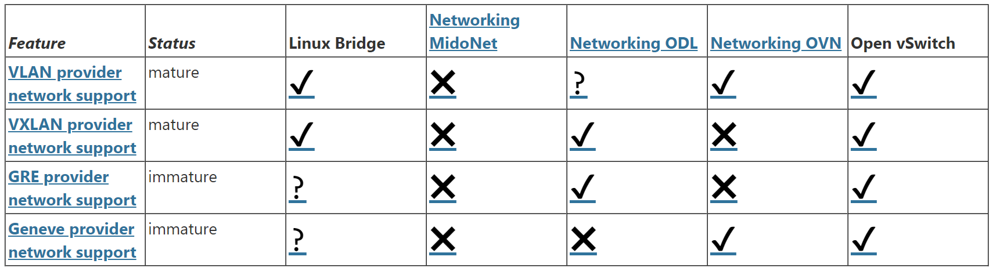
##### OVN
* [OVN](https://www.ovn.org/en/)
* [OVN:Open Virtual Network for Open vSwitch](http://www.openvswitch.org//support/slides/OVN-Vancouver.pdf)
* [交换机、路由器、网关的概念和用途](https://www.huaweicloud.com/articles/51b313f5ce75fcf27c6d99a0e8239c39.html)
##### docker网络映射原理
首先安装好docker后会多出来一块网卡叫做docker0，与容器进行互联，运行一个镜像都会开启一个容器，一个镜像可以运行多次，每当运行后都会产生新的ip地址新的配置参数，生成ip地址后，宿主机会多一块vethxxx的网卡，vethxxx的网卡连接docker容器中的ip地址和docker网桥，docker网桥再连接宿主的docker0网卡，当docker容器需要上网时，docker0网卡就会与宿主机网卡ens33或者其他的网卡接口进行内核转发实现nat地址转换，最终由eth网卡去访问互联网，最后依次返回。
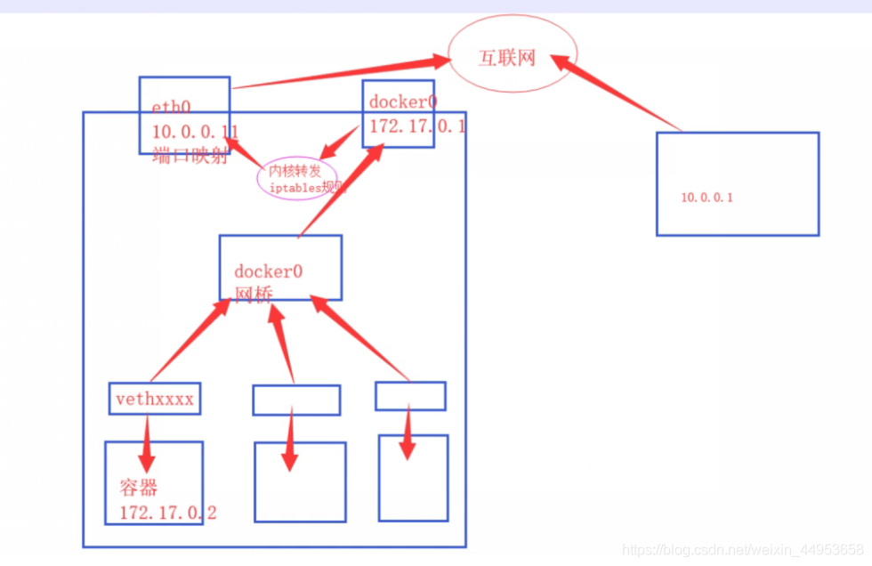
##### docker四种网络模型
* [docker的4种网络模型](https://www.huaweicloud.com/articles/0631c1b8375411f48a3d8471cfbc0a46.html)

##### DPDK-Data Plane Development Kit
[Data Plane Development Kit](https://en.wikipedia.org/wiki/Data_Plane_Development_Kit)

定义：网络数据包转发处理软件库。  
* 设计为运行在x86, POWER和ARM处理器上，它主要运行在Linux用户领域，有一个FreeBSD端口可用于DPDK特性的子集。DPDK是在开源BSD许可证下许可的。可以下载最新的补丁和增强功能。  

背景：在x86结构中，处理封包的传统方式是CPU中断方式，即网卡驱动接收到封包后通过中断通知CPU处理，然后由CPU拷贝资料并交给协议栈，因此在资料量大时，会产生大量的CPU中断，导致CPU无法执行其他程序。  
而DPDK采用轮询方式实现封包处理过程：DPDK多载了网卡驱动，驱动在收到封包后不会中断通知CPU，而是将封包通过零拷贝技术存入记忆体，这时应用方程式就可以通过DPDK提供的界面，直接从记忆体中读取封包。因此，节省了CPU中断事件、记忆体拷贝事件，并向应用层提供了简单易行且高效的封包处理方式，使得网路应用的开发更加方便。但同时，由于需要多载网卡驱动，因此该开发包只能用在部分采用Intel网络处理晶片的网卡中。  

特点：
* 核心优化：PMD，Poll Mode Driver,主动轮询
* 在最小生命周期数内收发包
* 开发快速数据包捕获算法(类似tcpdump)
* 运行第三方快速路径栈
* DPDK不同于Linux系统以通用性设计为目的，而是专注于网络应用中数据包的高性能处理。具体体现在DPDK应用程序是运行在用户空间上利用自身提供的数据平面库来收发数据包，绕过了Linux内核协议栈对数据包处理过程。它不是一个用户可以直接建立应用程序的完整产品，不包含需要与控制层（包括内核和协议堆栈）进行交互的工具。因此。相比原生 Linux（Native Linux），采用Intel DPDK技术后能够大幅提升IPV4的转发性能，可以让用户在迁移包处理应用时（从基于NPU的硬件迁移到基于Intel x86的平台上），获得更好的成本和性能优势。同时可以采用统一的平台部署不同的服务，如应用处理，控制处理和包处理服务。

核心模块：
* 网络层模块
* 内存管理模块
* 内核管理模块

对比分析
DPDK对从内核层到用户层的网络流程相对传统网络模块进行了特殊处理，下面对传统网络模块结构和DPDK中的网络结构做对比。  

传统linux网络层:硬件中断--->取包分发至内核线程--->软件中断--->内核线程在协议栈中处理包--->处理完毕通知用户层用户层收包-->网络层--->逻辑层--->业务层

dpdk网络层:硬件中断--->放弃中断流程  用户层通过设备映射取包--->进入用户层协议栈--->逻辑层--->业务层

对比后总结:

* dpdk优势:
  * 减少了中断次数。
  * 减少了内存拷贝次数。
  * 绕过了linux的协议栈，进入用户协议栈，用户获得了协议栈的控制权，能够定制化协议栈降低复杂度
* dpdk劣势
  * 内核栈转移至用户层增加了开发成本.
  * 低负荷服务器不实用，会造成内核空转.

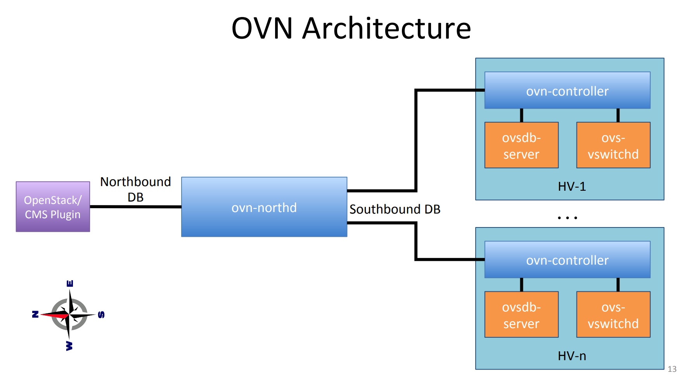
##### OVN
* [OVN:Open Virtual Network for Open vSwitch](openvswitch.org//support/slides/OVN-Vancouver.pdf)
##### NFV-[Network function virtualization](https://en.wikipedia.org/wiki/Network_function_virtualization)，网络功能虚拟化

网络架构理念，将整个网络中的各个功能节点虚拟化，连接成一个可通信的模块。  
一个NFV可能包括一个或多个运行不同软件和进程的虚拟机或容器，相较传统的服务器虚拟化技术，NFC可能包括一个或多个运行不同软件和进程的虚拟机或容器，不需要硬件设备的支持，史构建在标准的高容量服务器、交换机和存储设备，甚至是云计算基础设施之上。  
* [会话边界控制器SBC](https://baike.baidu.com/item/%E4%BC%9A%E8%B0%88%E8%BE%B9%E7%95%8C%E6%8E%A7%E5%88%B6%E5%99%A8/22923493?fromtitle=SBC&fromid=23647938)，Session Border Controller,一种NAT穿透的方式。SBC可确保VoIP 安全，又可提供媒体代理服务器的套件。
##### OpenFlow
* [OpenFlow-WIKIPEDIA](https://en.wikipedia.org/wiki/OpenFlow)
* [OpenFlow: Enabling Innovation in Campus Networks](http://ccr.sigcomm.org/online/files/p69-v38n2n-mckeown.pdf)
定义：基于TCP/IP提出的数据交换协议，将数据包的转发分为OpenFlow Switch和OpenFlow Controller分别独立完成，实现了控制层面和转层面的分离，控制器只负责转发规则，交换机只执行转发，且交换机和控制器通过Ip网络链接，可以不位于同一台主机上。

组成：
* OpenFlow交换机进行数据层的转发；
* FlowVisor对网络进行虚拟化；
* Controller对网络进行集中控制，实现控制层的功能，本地维护一份流表Flow Table,定义了数据包的传输路径。 

OpenFlow协议支持三种信息类型：
* 每一个类型都有多个子类型。
* a) Controller/Switch消息，是指由Controller发起、Switch接收并处理的消息，主要包括Features、Configuration、Modify-State、Read-State、Packet-out、Barrier和Role-Request等消息。这些消息主要由Controller用来对Switch进行状态查询和修改配置等操作。
* b) 异步(Asynchronous)消息，是由Switch发送给Controller、用来通知Switch上发生的某些异步事件的消息，主要包括Packet-in、Flow-Removed、Port-status和Error等。例如，当某一条规则因为超时而被删除时，Switch将自动发送一条Flow-Removed消息通知Controller，以方便Controller作出相应的操作，如重新设置相关规则等。
* c) 对称(Symmetric)消息，顾名思义，这些都是双向对称的消息，主要用来建立连接、检测对方是否在线等，包括Hello、Echo和Experimenter三种消息。
另外出于安全和高可用性等方面的考虑，OpenFlow的规范还规定了如何为Controller和Switch之间的信道加密、如何建立多连接等(主连接和辅助连接)。

OpenFlow交换机的分类
* 专用的OpenFlow交换机：它是专门为支持OpenFlow而设计的。它不支持现有的商用交换机上的正常处理流程，所有经过该交换机的数据都按照OpenFlow的模式进行转发。专用的OpenFlow交换机中不再具有控制逻辑，因此专用的OpenFlow交换机是用来在端口间转发数据包的一个简单的路径部件。
* 支持OpenFlow的交换机：它是在商业交换机的基础上添加流表、安全通道和OpenFlow协议来获得了OpenFlow特性的交换机。其既具有常用的商业交换机的转发模块，又具有OpenFlow的转发逻辑，因此支持OpenFlow的交换机可以采用两种不同的方式处理接收到的数据包。

##### Ovs中的OpenFlow
* [云计算底层技术-openflow在OVS中的应用](https://opengers.github.io/openstack/openstack-base-openflow-in-openvswitch/)
Ovs可以使用OpenFlow Controller获取流表，也可以使用ovs-ofctl手动添加流表项。  
ovs是linux bridge一个很好的选择，支持多种flow，也可以同时维护多个流表，每个流表包括多个流表项，每条流表项包含多个匹配字段match fields以及匹配成功后要执行的指令集action set和统计信息。  
* [](images/openvswitch-openflow.png)
* 真实的Switch硬件存储RIB和FIB，靠查询TCAM来匹配路由表项，Open vSwitch的话只能靠纯软件数据结构实现，没记错的话有哈希表实现的O(1)查找，还有链表实现的O(n)查找，路由表项都存储在内存里。
从协议扩展上来说，一般的硬件Switch对协议的解析流程都是固化的，当然好的交换机也可以通过后期的固件升级支持新的协议，而Open vSwitch只需要改代码就可以，可以适应快并且激烈的网络协议变化（比如OpenFlow）
##### OpenStack,即ODL
* [OpenStack](https://www.openstack.org/)
* [OpenStack-Wikipedia](https://en.wikipedia.org/wiki/OpenStack)

开源的云计算管理平台项目，是一系列软件开源项目的组合。
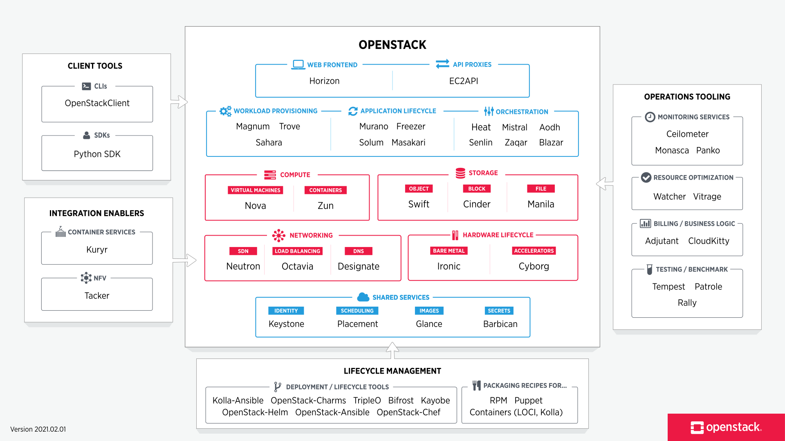
##### OpenDaylight
* [OpenDaylight](https://www.opendaylight.org/)
* [OpenDaylight Project-wikipedia](https://en.wikipedia.org/wiki/OpenDaylight_Project)
* [Installing OpenDaylight](https://docs.opendaylight.org/en/stable-carbon/getting-started-guide/installing_opendaylight.html)
Open Daylight是一个高度可用、模块化、可扩展、支持多协议的控制器平台,可以作为SDN管理平面管理多厂商异构的SDN网络.基于Karaf容器.
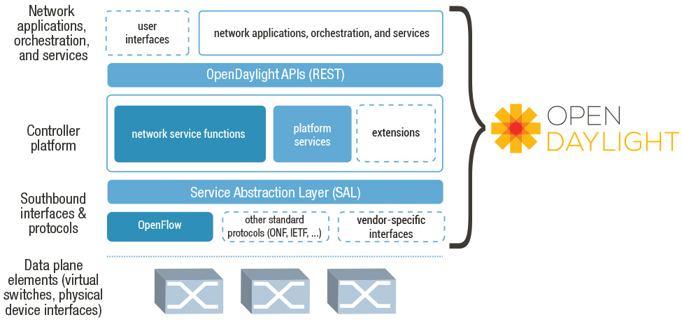
* SDN的一种实现方式
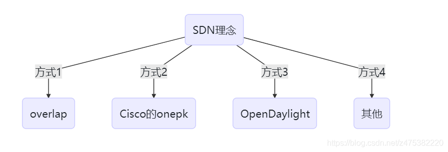
##### SDN（Software Defined Network）
　　基于OpenFlow实现SDN，则在网络中实现了软硬件的分离以及底层硬件的虚拟化，从而为网络的发展提供了一个良好的发展平台。 
##### OpenShift SDN
OpenShift SDN使用了OpenvSwitch、VXLAN隧道、OpenFlow规则和iptables。这个网络可以通过使用巨帧、网卡卸载、多队列和ethtool设置来调优。
##### veth network
veth:Vitual Ethernet Device
* 为container所建,成对出现
* 作用是把一个network namespace发出的数据包转发到另一个namespace，veth设备充当了连接两个network namespace的一根虚拟网线的作用。

#### (四) CVE+CVSS(写到了论文中，没有在这里补充)
##### 1.CVE
##### 2.CVSS
## Ⅳ 结项
### 毕设论文要求
* 应该抛开方法将问题本身，准确输出让别人能看懂前因后果
* 选题依据+心路历程+解决历程+最后方法的裁决
   * 各种方法的比较分析
   * 体现思路和思维，深入思考最佳方法
### 实验总结
重点： 红队仿真/攻击方仿真/Adversary Emulation

## Ⅴ 实验及结果
### 实验环境
ubuntu 16.04 TLS amd64+docker+docker-compose
### 实验步骤
#### 一、模拟运行攻击方工具
* 模拟运行攻击方工具、入侵检测系统、以及配置攻击脚本运行环境
##### 0. Install vmware and virtualbox on ubuntu 16.04 LTS(没用到虚拟机)
[virtualbox官网](https://www.virtualbox.org/)下载virtualbox-6.1_6.1.18-142142_Ubuntu_xenial_amd64.deb，并使用scp拷贝到ubuntu虚拟机中，重命名为virtualbox.deb。
```
sudo apt-get install  libqt5x11extras5 libsdl1.2debian
sudo dpkg -i virtualbox.deb
sudo virtualbox
```
* 参考[ubuntu 16.04下安装VMware-Workstation-12/14详细步骤](https://blog.51cto.com/337962/2095824)
```
# 安装开发工具
sudo apt install build-essential\

# 安装axel，使用axel下载vmware
# (-n 选项指定线程的数目)
sudo apt-get install axel
axel -n 100 https://download3.vmware.com/software/wkst/file/VMware-Workstation-Full-12.1.1-3770994.x86_64.bundle 
# 赋予权限
chmod +x VMware-Workstation-Full-12.1.1-3770994.x86_64.bundle
# 安装组件
sudo apt-get install murrine-themes
sudo apt-get install gtk2-engines-murrine
sudo apt-get install libgtkmm-2.4-1c2a(libgtkmm-2.4-1v5:i386套件的其中之一)
sudo apt-get install libgtkmm-2.4-dev
sudo apt-get install libcanberra-gtk-module:i386
sudo apt-get install gnome-tweak-tool
sudo apt-get install gksu
# install
sudo ./VMware-Workstation-Full-12.5.5-5234757.x86_64.bundle
# 手动next安装完成
```
##### 1. Install Docker and Docker Compose
* 参考[Install Docker Engine on Ubuntu](https://docs.docker.com/engine/install/ubuntu/)

Install Docker
```
1. Update the apt package index and install packages to allow apt to use a repository over HTTPS:
$ sudo apt-get update

$ sudo apt-get install \
    apt-transport-https \
    ca-certificates \
    curl \
    gnupg-agent \
    software-properties-common

2. Add Docker’s official GPG key:
$ curl -fsSL https://download.docker.com/linux/ubuntu/gpg | sudo apt-key add -

# Verify that you now have the key with the fingerprint 9DC8 5822 9FC7 DD38 854A  E2D8 8D81 803C 0EBF CD88, by searching for the last 8 characters of the fingerprint.

$ sudo apt-key fingerprint 0EBFCD88
# pub   rsa4096 2017-02-22 [SCEA]
#       9DC8 5822 9FC7 DD38 854A  E2D8 8D81 803C 0EBF CD88
# uid           [ unknown] Docker Release (CE deb) <docker@docker.com>
# sub   rsa4096 2017-02-22 [S]

4. Use the following command to set up the stable repository. To add the nightly or test repository, add the word nightly or test (or both) after the word stable in the commands below. Learn about nightly and test channels.
amd64:  
$ sudo add-apt-repository \
   "deb [arch=amd64] https://download.docker.com/linux/ubuntu \
   $(lsb_release -cs) \
   stable"

5. Update the apt package index, and install the latest version of Docker Engine and containerd, or go to the next step to install a specific version:
 $ sudo apt-get update
 $ sudo apt-get install docker-ce docker-ce-cli containerd.io

```
Install Docker-compose
```
sudo curl -L "https://github.com/docker/compose/releases/download/1.24.0/docker-compose-$(uname -s)-$(uname -m)" -o /usr/local/bin/docker-compose

sudo chmod +x /usr/local/bin/docker-compose
sudo ln -s /usr/local/bin/docker-compose /usr/bin/docker-compose
docker-compose --version
docker-compose version 1.15.0, build e12f3b9
```
##### 2. Install [Infection Monkey](https://www.guardicore.com/infectionmonkey/)（由于之后与靶场不符合，过程中淘汰）

从[Infection Monkey](https://www.guardicore.com/infectionmonkey/)官网上下载得到monkey-island-docker.tar.gz。使用scp拷贝到虚拟机当中。解压得到dk.monkeyisland.1.9.0.tar。   

```
sudo docker load -i dk.monkeyisland.1.9.0.tar
sudo docker pull mongo
sudo mkdir -p /var/monkey-mongo/data/db
sudo docker run --name monkey-mongo --network=host -v /var/monkey-mongo/data/db:/data/db -d mongo
sudo docker run --name monkey-island --network=host -d guardicore/monkey-island:1.9.0
```
Use Infection Monkey
访问https://<server-ip>:5000  

注册用户名和密码后，进入使用页面  


##### 3. Install caldera
```
git clone https://github.com/mitre/caldera.git --recursive --branch 3.0.0
cd caldera
pip3 install -r requirements.txt
python3 server.py --insecure
```
访问```http://localhost:8888```
##### 4. Intsall Metasploit Framework
* [metasploit-framework=github](https://github.com/rapid7/metasploit-framework)
```
curl https://raw.githubusercontent.com/rapid7/metasploit-omnibus/master/config/templates/metasploit-framework-wrappers/msfupdate.erb > msfinstall && \
  chmod 755 msfinstall && \
  ./msfinstall

# To check to see if the database was set up
db_status
# To enable and start using the local database
msfdb init

msfconsole --version
# Framework Version: 6.0.40-dev-
```
##### 5. Install java
```
# Installing the Default JRE/JDK
# update the package index.
sudo apt-get update
# install Java. Specifically, this command will install the Java Runtime Environment (JRE).
sudo apt-get install default-jre
# install the JDK 
sudo apt-get install default-jdk

# Installing the Oracle JDK
add Oracle’s PPA, then update your package repository.
sudo add-apt-repository ppa:webupd8team/java
sudo apt-get update
# install Oracle JDK 8
sudo apt-get install oracle-java8-installer
```
##### 6. Install Suricata
* [How To Install And Setup Suricata IDS On Ubuntu Linux 16.04](https://www.unixmen.com/install-suricata-ids-on-ubuntu-16-04/)
* [Suricata-Installation](https://suricata.readthedocs.io/en/suricata-6.0.0/install.html)
```
sudo apt-get update
sudo apt-get install libpcre3-dbg libpcre3-dev autoconf automake libtool libpcap-dev libnet1-dev libyaml-dev zlib1g-dev libcap-ng-dev libmagic-dev libjansson-dev libjansson4
sudo apt-get install libnetfilter-queue-dev libnetfilter-queue1 libnfnetlink-dev

wget http://www.openinfosecfoundation.org/download/suricata-3.1.1.tar.gz
tar -zxf suricata-3.1.1.tar.gz
cd suricata-3.1.1/
./configure --enable-nfqueue --prefix=/usr --sysconfdir=/etc --localstatedir=/var
sudo make 
sudo make install-conf

# Suricata IDS Configurations
sudo make install-rules
ls /etc/suricata/rules
vim /etc/suricata/suricata.yaml

# Using Suricata to Perform Intrusion Detection
ethtool -K eth0 gro off lro off
/usr/bin/suricata --list-runmodes
# start Suricata in pcap live mode
/usr/bin/suricata -c /etc/suricata/suricata.yaml -i ens160 --init-errors-fatal
```
##### 7. Install Bro/Zeek
```
sudo apt-get update

# Install Required Packages
sudo apt-get install cmake make gcc g++ flex git bison python-dev swig libgeoip-dev libpcap-dev libssl-dev zlib1g-dev -y libgeoip-dev -y

# Download both the IPv4 and IPv6 databases
wget https://src.fedoraproject.org/lookaside/pkgs/GeoIP/GeoLiteCity.dat.gz/2ec4a73cd879adddf916df479f3581c7/GeoLiteCity.dat.gz
wget https://mirrors-cdn.liferay.com/geolite.maxmind.com/download/geoip/database/GeoLiteCityv6.dat.gz
gzip -d GeoLiteCity.dat.gz
gzip -d GeoLiteCityv6.dat.gz
sudo mv GeoLiteCity.dat /usr/share/GeoIP/GeoIPCity.dat
sudo mv GeoLiteCityv6.dat /usr/share/GeoIP/GeoIPCityv6.dat

# Installing Bro From Source
sudo git clone --recursive git://git.bro.org/bro
cd bro
sudo git submodule update --recursive --init 
./configure
make
sudo make install
```
#### 二、准备一个四台靶机的靶场环境
* Writeup内部保留
##### 0. 靶场信息
###### 靶场还原CVE列表
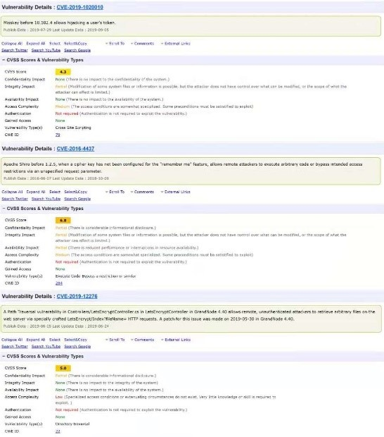
###### 靶标部署结果列表
|靶机序号	|靶机名称|	漏洞名称|	数据库|	入侵检测系统|
|----|----|----|----|----|
|靶标-1|	misskey-11.20.1|	CVE-2019-1020010	|redis 4.0.4|	zeek:alpine|
|靶标-2	|oa-shiro-url|	CVE-2016-4437	|mysql 5.6	|zeek:alpine|
|靶标-3	|biubiu-s2-007|	无|	mysql 5.6.48	|zeek:alpine|
|靶标-4|	GrandNode	|CVE-2019-12276|	mongo	|zeek:alpine|

##### 1. DVE-1 misskey-11.20.1---CVE-2019-1020010
* [CVE-2019-1020010](https://cve.mitre.org/cgi-bin/cvename.cgi?name=CVE-2019-1020010)
Misskey是一套微型博客平台。 Misskey 10.102.4之前版本中存在安全漏洞。攻击者可利用该漏洞劫持用户令牌。 

###### BUILD
* [Poc-CVE-2019-1020010](https://github.com/nomi-sec/PoC-in-GitHub)  
* [Misskey](https://github.com/misskey-dev/misskey)
* [Misskey-Docker 部署指南](https://github.com/misskey-dev/misskey/blob/develop/docs/docker.zh.md)
* [使用Docker最小化部署Misskey](https://candinya.com/posts/minimal-misskey-docker-deploy/)
* [DXY0411/CVE-2019-1020010](https://github.com/DXY0411/CVE-2019-1020010)---来自同学的交流与帮助
###### BUILD FEATURES：
* db: redis 4.0.4
* ids: zeek:alpine
###### BUILD RESULT
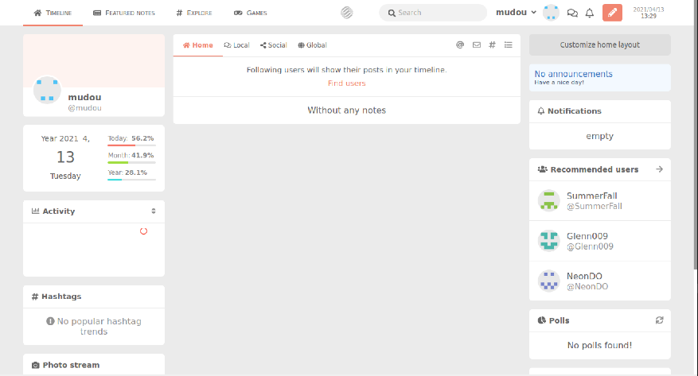
##### 2. DVE-2 oa_shiro_url---CVE-2016-4437
###### BUILD
* [CVE-2016-4437](https://cve.mitre.org/cgi-bin/cvename.cgi?name=CVE-2016-4437)
* [【漏洞复现】Apache Shiro 1.2.4反序列化漏洞复现及分析(cve-2016-4437)](https://www.matrixghd.com/2020/10/16/%E6%BC%8F%E6%B4%9E%E5%A4%8D%E7%8E%B0-Apache-Shiro-1.2.4%E5%8F%8D%E5%BA%8F%E5%88%97%E5%8C%96%E6%BC%8F%E6%B4%9E%E5%A4%8D%E7%8E%B0%E5%8F%8A%E5%88%86%E6%9E%90(cve-2016-4437)/)
###### BUILD FEATURES：
* db: mysql 5.6
* ids: zeek:alpine
###### BUILD RESULT
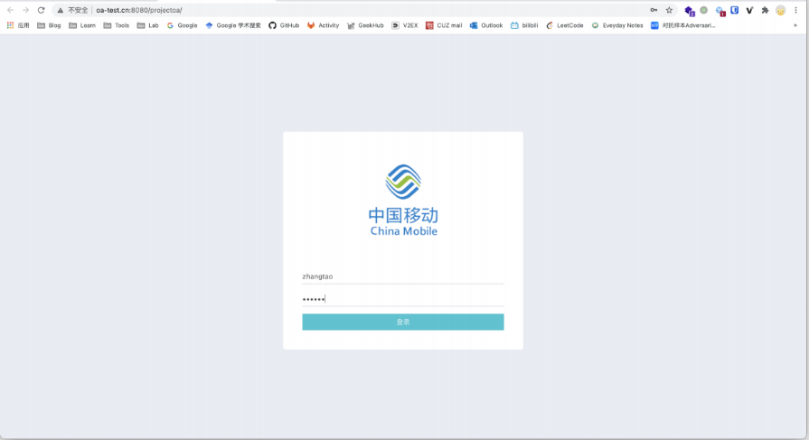
##### 3. DVE-3 biubiu-s2-007---jumpserver
###### BUILD FEATURES:
* db: mysql 5.6.48
* ids: zeek:alpine
###### BUILD RESULT

##### 4. DVE-4 GrandNode---CVE-2019-12276
###### BUILD FEATURES:
* db:mongo
* ids:zeek:alpine
###### BUILD RESULT


##### 5. Install Open vSwitch
```
# ubuntu16.04
sudo apt-get install openvswitch-switch
ovs-vsctl --version
ovs-vsctl (Open vSwitch) 2.5.9
Compiled Jan 28 2021 19:49:45
DB Schema 7.12.1

# change the access permissions
sudo cd /usr/bin
sudo chmod a+rwx ovs-docker

# enter every container
apt-get install -y openvswitch-switch openvswitch-common
# special for misskey, based on alpine
apk add openvswitch
```
##### 6. 网络连通性配置
* [How to use an OVS Bridge for Networking on Docker?](https://www.tutorialspoint.com/how-to-use-an-ovs-bridge-for-networking-on-docker)
* [docker network create](https://docs.docker.com/engine/reference/commandline/network_create/)
* [Open vSwitch on Linux, FreeBSD and NetBSD-validating](https://docs.openvswitch.org/en/latest/intro/install/general/#validating)
* [Multi-Host Overlay Networking with Open vSwitch](https://docker-k8s-lab.readthedocs.io/en/latest/docker/docker-ovs.html)
```
# create an ovs bridge
sudo ovs-vsctl add-br ovs-br1
sudo ovs-vsctl add-br ovs-br2
sudo ovs-vsctl add-br ovs-br3
# delete an ovs bridge
sudo ovs-vsctl --if-exists del-br ovs-br1
# details
mudou@mudou-VirtualBox:~$ sudo ovs-vsctl show
[sudo] password for mudou:
788e363e-c745-4951-b500-3a0315f3a177

    Bridge "ovs-br1"
        Port "ovs-br1"
            Interface "ovs-br1"
                type: internal
# 添加网卡
mudou@mudou-VirtualBox:~$ sudo ovs-docker add-port ovs-br1 eth1 misskey-11.20.1-web-app --ipaddress="10.1.0.1/24" --gateway="10.1.0.254" --macaddress="00:00:01:00:00:01"
ovs-docker: Port already attached for CONTAINER=misskey-11.20.1-web-app and INTERFACE=eth1
mudou@mudou-VirtualBox:~$ sudo ovs-docker add-port ovs-br1 eth1 oa-shiro-url-web-app --ipaddress="10.2.0.2/24" --gateway="10.2.0.254" --macaddress="00:00:02:00:00:02" RTNETLINK answers: File exists
mudou@mudou-VirtualBox:~$ sudo ovs-docker add-port ovs-br1 eth1 biubiu-s2-007_web_1 --ipaddress="10.2.0.3/24" --gateway="10.2.0.254" --macaddress="00:00:02:00:00:03"  RTNETLINK answers: File exists
mudou@mudou-VirtualBox:~$ sudo ovs-docker add-port ovs-br1 eth2 biubiu-s2-007_web_1 --ipaddress="10.3.0.2/24" --gateway="10.3.0.254" --macaddress="00:00:03:00:00:02"
RTNETLINK answers: File exists
mudou@mudou-VirtualBox:~$ sudo ovs-docker add-port ovs-br1 eth1 grandnode-4.40-web-app --ipaddress="10.3.0.3/24" --gateway="10.3.0.254" --macaddress="00:00:03:00:00:03"
* 增加流表规则实现连通性（不公开）
```
###### 配置结果  
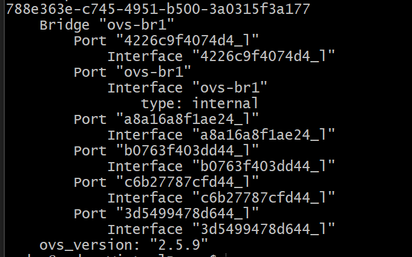
###### 连通性测试
网段一  
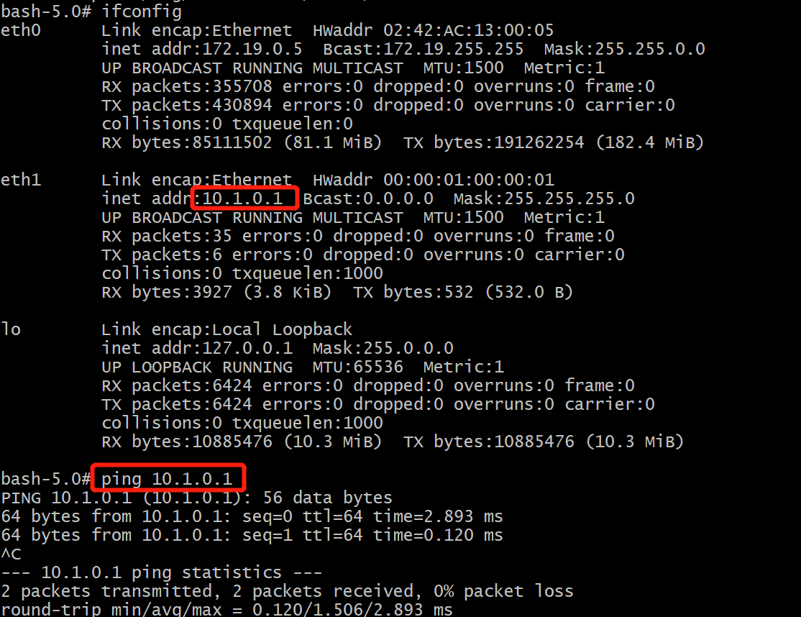
网段二   
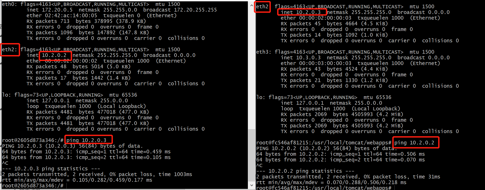
网段三   
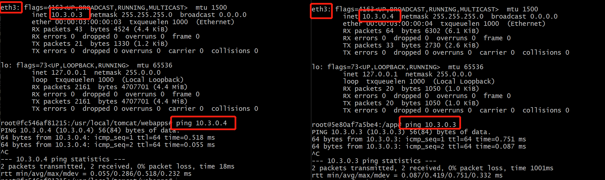
###### 网络连通性实践数据草稿
未使用Open vSwitch时网络情况
| 主机序号 | 主机名称 | 漏洞名称| 桥接网络Ip | 端口映射 | 访问网址 |
|----|----|----|----|----|----|
|DEV-1|misskey-11.20.1|CVE-2019-1020010|172.19.0.1|3000->3000/tcp 11277->22/tcp|127.0.0.1:3000 172.19.0.1:3000 192.168.122.1:3000|
|DVE-2|oa-shiro-url|CVE-2016-4437|172.20.0.1|10020->22/tcp 11020->28/tcp 8123->8080/tcp|127.0.0.1:8123/projectoa 172.20.0.1:8123/projectoa 192.168.122.1:8123/projectoa|
|DVE-3|biubiu-s2-007|jumpserver|172.18.0.1|8135->8080/tcp|127.0.0.1:8135 172.18.0.1:8135 192.168.122.1:8135|
|DVE-4|GrandNode|CVE-2019-12276|172.21.0.1|10049->22/tcp 8181->8080/tcp|127.0.0.1:8181 172.21.0.1:8181 192.168.122.1:8181|

网络连通性部署  
```brctl show```查看veth设备与各个网桥的连接情况，四个靶机都成功运行时的连接情况如下图所示。  
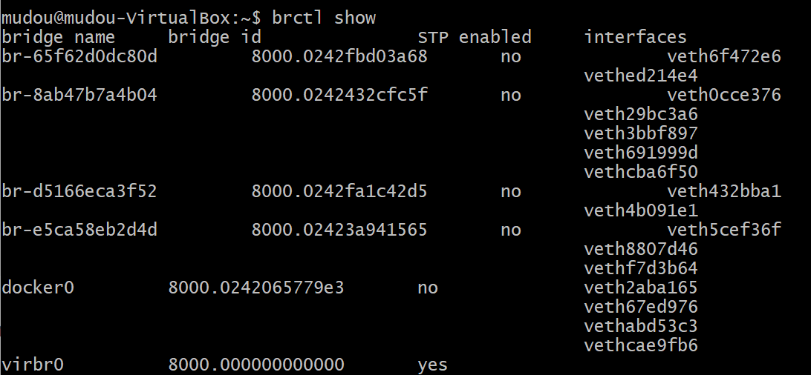

* ip写错了，需要删除ovs新建的网桥
参考[ovs-vsctl del-br](https://docs.pica8.com/display/PICOS2111cg/ovs-vsctl+del-br)，执行```sudo ovs-vsctl --if-exists del-br ovs-br2```删除ovs-br2,然后新建。

* 【实践中思考】直接新建docker bridge network,添加container，不用ovs可不可以?两者之间各有什么优缺点？用ovs的好处是什么？
docker bridge network可以了，增加网卡和网桥即可
```
# connect containers with the network:
docker network connect myNetwork container1-web
docker network connect myNetwork container2-web
```

| DEV序号 | container-name | container-id |
|----|----|----|
|DVE-1|misskey-11.20.1-web-app|9f342a322dba|
|DVE-2|oa-shiro-url-web-app|2605d873a346|
|DVE-3|biubiu-s2-007_web_1|fc546af81215|
|DVE-4|grandnode-4.40-web-app|5e80af7a5be4|

veth设备情况：
|DVE序号|web-app-name|bridge name |    bridge id        |       STP enabled    | interfaces|
|----|----|----|----|

|DVE-1|misskey-11.20.1|br-8ab47b7a4b04     |   8000.02420aee6b68 | no  |veth19005fd veth3155cea veth5d5c52b veth9d936c3 vethcef077b|
|DVE-2|oa-shiro-url|br-e5ca58eb2d4d  |       8000.0242fa6eb7ab     |  no|  veth55a06fd veth9969326 vethf473ddf|
|DVE-3|biubiu-s2-007|br-d5166eca3f52     | 8000.024211cef061       |no  |veth6ca72a3 vetha3d5a31|
|DVE-4|GrandNode|br-65f62d0dc80d     |    8000.0242e0f3e490 | no | vethd4fcd05 vethfc7911d|
|None|None|docker0        | 8000.02424ecfd188    |  no    |veth3c18c3b veth6c890c3 vethd8b5572 vethfe71c4a|
|None|None|virbr0|          8000.000000000000      | yes|   |

```
# check connection
sudo docker network inspect docker1
# 依次进入containers
sudo docker exec -ti 9f342a322dba bash 
sudo docker exec -ti 2605d873a346 bash
sudo docker exec -ti fc546af8121 bash
sudo docker exec -ti 5e80af7a5be4 bash
# 依次进入容器查看veth pair 
cat /sys/class/net/eth0/iflink
# 主系统中找到对应的号
ip link
# 依次得到各个web-app容器在物理机上的veth pair
DVE-1 30 veth06da16e@if29
DVE-2 42 veth5e198ee@if41
DVE-3 60 veth42be325@if59
DVE-4 46 vethd7af8ae@if45
```
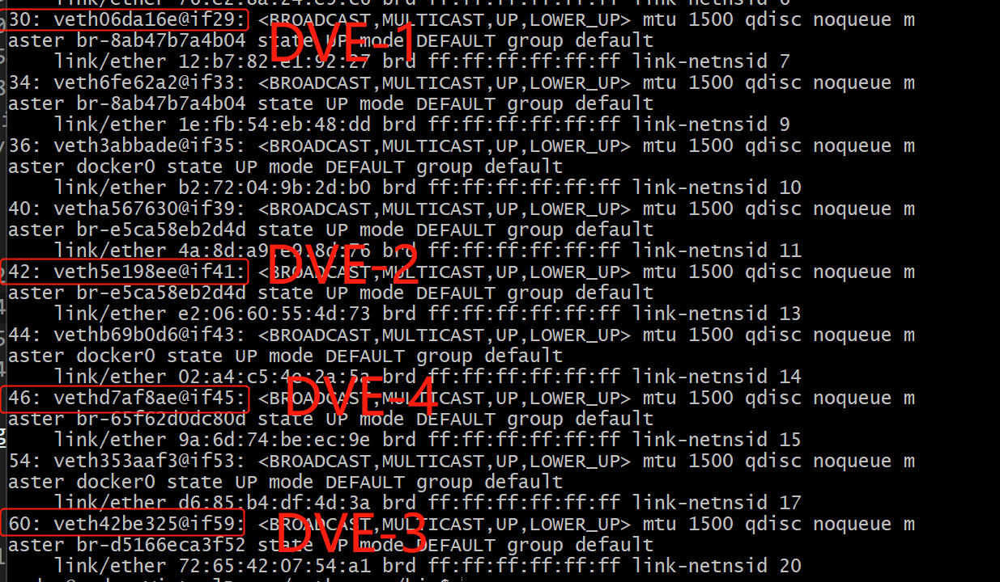
```
# install ping-tool
apt-get update
apt-get install inetutils-ping
apt-get install iputils-ping
apt-get install net-tools

# check connection
sudo docker network inspect docker1
#
sudo docker exec -ti 2605d873a346 ping 2605d873a346
sudo docker exec -ti 2605d873a346 ping 172.22.0.3

```
|DVE序号|靶机名称|docker-bridge-network-name|internal-GW-address|web-app-ip-address|
|----|----|----|----|----|
|DVE-1|misskey-11.20.1|br-8ab47b7a4b04|172.19.0.1|172.19.0.5|
|DVE-2|oa-shiro-url|br-e5ca58eb2d4d|172.20.0.1|172.20.0.5|
|DVE-3|biubiu-s2-007|br-d5166eca3f52|172.18.0.1|172.18.0.3|
|DVE-4|GrandNode|br-65f62d0dc80d|172.21.0.1|172.21.0.3|

#### 三、用攻击方模拟工具威胁模拟
##### 威胁模拟流程图
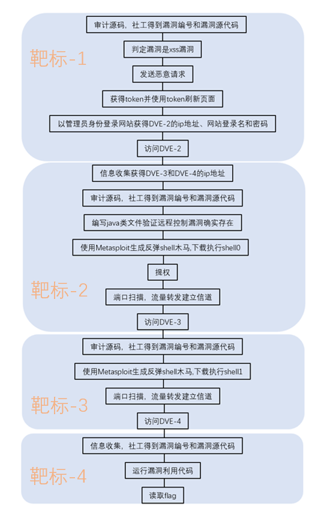
##### 威胁模拟结果图
DVE-1
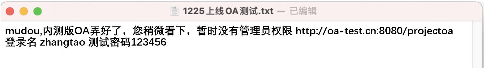
DVE-2
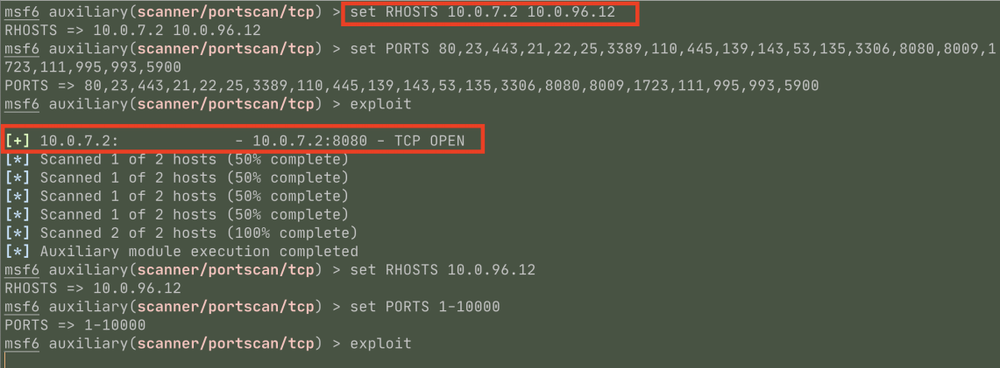
DVE-3

DVE-4

#### 四、Python自动化攻击脚本
##### 功能框架图
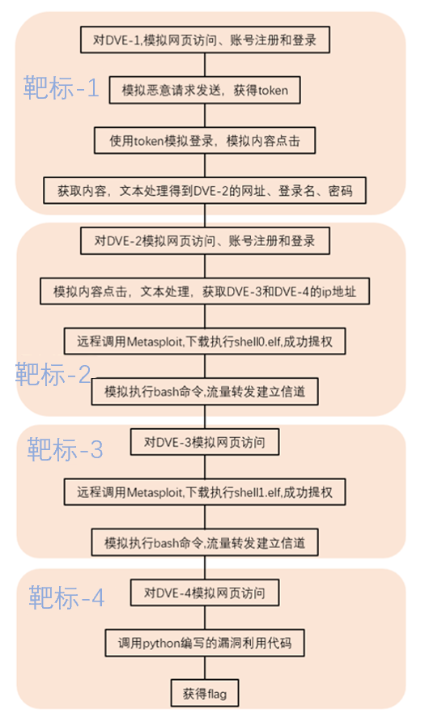
##### 攻击结果
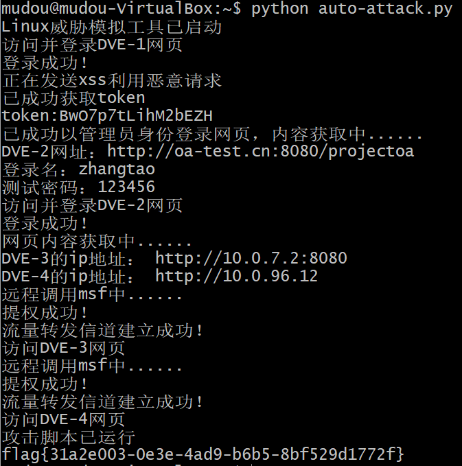
#### 五、实验结果
##### IDS检测情况
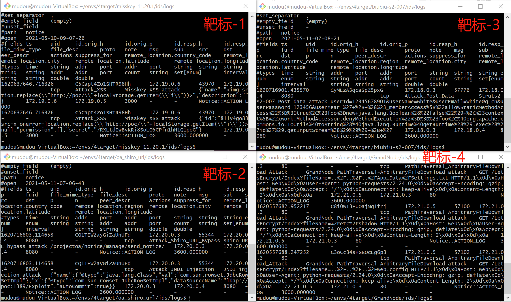
#### 六、实验问题
##### 一、模拟运行攻击方工具
###### 1. Install Docker and Docker-compose
 1)执行```sudo apt-get install docker-ce docker-ce-cli containerd.io```时出现报错:'Unable to locate package `docker-ce` on a 64bit ubuntu'。参考[Unable to locate package `docker-ce` on a 64bit ubuntu](https://unix.stackexchange.com/questions/363048/unable-to-locate-package-docker-ce-on-a-64bit-ubuntu)执行：
```
sudo apt-get install apt-transport-https ca-certificates curl software-properties-common
curl -fsSL https://download.docker.com/linux/ubuntu/gpg | sudo apt-key add -
sudo add-apt-repository "deb [arch=amd64] https://download.docker.com/linux/ubuntu xenial stable"

sudo apt update
apt-cache search docker-ce
sudo apt-get install docker-ce docker-ce-cli containerd.io
```
2)执行```docker-compose --version```的结果是```docker-compose version 1.8.0, build unknown```
参考[unable to build docker-compose build](https://stackoverflow.com/questions/45978035/unable-to-build-docker-compose-build)  
解决：
```
sudo apt-get purge docker-compose
sudo curl -o /usr/local/bin/docker-compose -L "https://github.com/docker/compose/releases/download/1.15.0/docker-compose-$(uname -s)-$(uname -m)"
sudo chmod +x /usr/local/bin/docker-compose
sudo ln -s /usr/local/bin/docker-compose /usr/bin/docker-compose
docker-compose --version
docker-compose version 1.15.0, build e12f3b9
```
###### 2. Install Infection Monkey
（1）执行'sudo docker pull mongo'时报错：'Error response from daemon: Head https://registry-1.docker.io/v2/library/mongo/manifests/latest: Get https://auth.docker.io/token?scope=repository%3Alibrary%2Fmongo%3Apull&service=registry.docker.io: net/http: TLS handshake timeout'。  
参考[ERROR: Get https://registry-1.docker.io/v2/: net/http: TLS handshake timeout in Docker](https://stackoverflow.com/questions/52252791/error-get-https-registry-1-docker-io-v2-net-http-tls-handshake-timeout-in),重启docker```sudo systemctl restart docker```解决。

* 执行'sudo docker pull mongo'时docker pull太慢，参考[Docker下载镜像太慢问题](https://www.cnblogs.com/spll/p/11828193.html)
```
sudo vim /etc/docker/daemon.json

{
  "registry-mirrors":["https://almtd3fa.mirror.aliyuncs.com"]
}

service docker restart
```

##### 二、准备一个四台靶机的靶场环境
（1）执行```./docker-compose_up.sh```时，出现报错
```
ERROR: Version in "./docker-compose.yml" is unsupported. You might be seeing this error because you're using the wrong Compose file version. Either specify a supported version (e.g "2.2" or "3.3") and place your service definitions under the `services` key, or omit the `version` key and place your service definitions at the root of the file to use version 1.
For more on the Compose file format versions, see https://docs.docker.com/compose/compose-file/
```
解决：* 参考[Compose file](https://docs.docker.com/compose/compose-file/)
可以看到version为3.4的docker-compose需要的docker引擎是17.09.0+,当前的版本信息如下：
```
docker --version
Docker version 20.10.5, build 55c4c88
docker-compose --version
docker-compose version 1.15.0, build e12f3b9
```
重新下载docker-compose
```
# uninstall docker-compose
sudo rm /usr/local/bin/docker-compose
pip uninstall docker-compose

# install docker-compose
sudo curl -L --fail https://github.com/docker/compose/releases/download/1.28.6/run.sh -o /usr/local/bin/docker-compose
sudo chmod +x /usr/local/bin/docker-compose
```
（2）使用tmux时出现报错```error connecting to /tmp/tmux-1000/default (No such file or directory)```    
* 参考[tmux Introduction, Configuration, and Boot-Time Setup](https://markmcb.com/2016/05/23/tmux-introduction-configuration-boot-time-setup/)
```
# Setup a session called "stuff" that has 2 windows.
# The first window we'll call "text-to-file"
# We want it putting dates into a text file
tmux new-session -d -s stuff -n text-to-file -c /tmp 'watch -n1 "date >> date_file"'

# Vertically split the window in step 1 into 2 panes.
# The second pane tails the dates file.
tmux split-window -d -t stuff:text-to-file -c /tmp -v 'watch -n1 tail -n10 date_file'

# Create second window called "monitor" running top.
tmux new-window -d -a -t stuff:text-to-file -n monitor 'top'

# Horizontally split the window in step 3 into 2 panes.
# The second pane is watching the /tmp folder for changes.
tmux split-window -d -t stuff:monitor -c /tmp -h 'watch -n3 ls -la'
```
还是没有解决，发现是版本太旧，参考[How to install the latest tmux on Ubuntu 16.04](https://bogdanvlviv.com/posts/tmux/how-to-install-the-latest-tmux-on-ubuntu-16_04.html)重新安装。
```
sudo apt update

sudo apt install -y git

sudo apt install -y automake
sudo apt install -y bison
sudo apt install -y build-essential
sudo apt install -y pkg-config
sudo apt install -y libevent-dev
sudo apt install -y libncurses5-dev

rm -fr /tmp/tmux

git clone https://github.com/tmux/tmux.git /tmp/tmux

cd /tmp/tmux

git checkout master

sh autogen.sh

./configure && make

sudo make install

cd -

rm -fr /tmp/tmux
```
（3）出现报错```sudo docker exec -ti 2605d873a346 ping fc546af81215 OCI runtime exec failed: exec failed: container_linux.go:367: starting container process caused: exec: "ping": executable file not found in $PATH: unknown```    
* 参考[OCI runtime exec failed: exec failed: container_linux.go:344: starting container process](https://stackoverflow.com/questions/55378420/oci-runtime-exec-failed-exec-failed-container-linux-go344-starting-container)
```
sudo apt-get update
sudo apt-get install inetutils-ping

mkdir ubuntu_with_ping
cat >ubuntu_with_ping/Dockerfile <<'EOF'
FROM ubuntu
RUN apt-get update && apt-get install -y iputils-ping
CMD bash
EOF
docker build -t ubuntu_with_ping ubuntu_with_ping
docker run -it ubuntu_with_ping
```

## Ⅵ 场景设计总结
### 靶场场景图
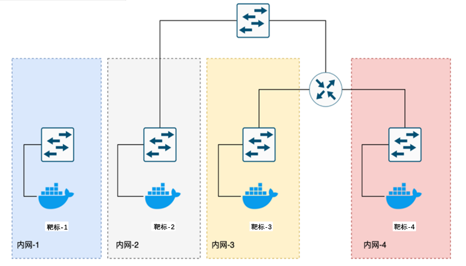
### 连通性需求
* 内⽹-1 和其他内⽹均不连通 
* 内⽹-2 和 内⽹-3 双向连通 
* 内⽹-2 和 内⽹-4 双向不连通 
* 内⽹-3 和 内⽹-4 双向连通
### 靶标需求
* DVE-1 配置域名访问⽅式，具备「信息泄露」效果 
* DVE-2 配置域名访问⽅式，需要管理员⽤户帐号登录，最终要达到「RCE」效果 
* DVE-3 游客身份下，最终要达到「RCE」效果 
* DVE-4 具备「任意⽂件读取」效果
### 基础设施需求
⽹络拓扑中的路由器和交换机基于 ovs 实现。
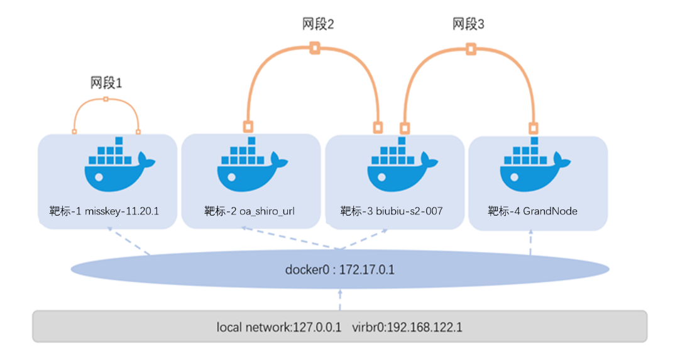
### 靶标列表
|编号| DVE名称 |漏洞利⽤条件（所需权限）| 漏洞利⽤效果| 备注|
|----|----|----| ---- | ---- |
|DVE-1| misskey-11.20.1| ⽆权限约束 |获取管理员| cookie| ⽆|
|DVE-2 |oa-shiro-url| 管理员帐号|远程代码执⾏ |⽆|
|DVE-3| biubiu-s2-007| ⽆权限约束|远程代码执⾏| ⽆|
|DVE-4 |GrondNode |⽆权限约束 |路径遍历任意⽂件读取| ⽆|
### 攻击路径
1. 攻击者通过域名访问 DVE-1，利⽤ XSS 漏洞获得管理员⽤户的 cookie 
2. 利⽤管理员 cookie，查看并下载管理员⽤户的⽹盘内容（DVE-1 包含个⼈⽂件存储功能），发现 DVE2 的域名和帐号密码 
3. 访问第 2 步获取的 DVE-2 的域名，并登录账户，在内部公告信息⾥看到内⽹服务上线信息，得到 DVE-3 和 DVE-4 的 IP。同时进⾏漏洞利⽤并拿到 shell-0 
4. 利⽤获得的 shell-0，对第 3 步获取的 DVE-3 IP 进⾏端⼝扫描并建⽴信道，⽽ DVE-4 IP 访问不通。 
5. 访问 DVE-3 并进⾏漏洞利⽤，最终拿到 shell-1 
6. 利⽤获得的 shell-1，对第 3 步获取的 DVE-4 IP 进⾏端⼝扫描并建⽴信道 
7. 访问 DVE-4 并进⾏漏洞利⽤，最终读取 /flag.txt ⽂件
### 基于 ATT&CK 的攻击技术图
* [attack.github.io](https://mitre-attack.github.io/attack-navigator/v2/enterprise/)
* [attack-navigator](https://github.com/mitre-attack/attack-navigator)
* 该攻击技术图没有区分技术点的重要性，仅仅突出本次实验涉及到的技术点
* 该攻击技术图精确到sub-technique
* 超级方便，同名technique可以同步点亮
* 在点亮的过程中，以查字典的方式，先顾名思义第一次过滤，再根据编号或名称进一步对比分析。
  * 比如[Resource Development]下有[Acquire Infrastructure]和[Compromise Infrustructure],这两个technique拥有相同的sub-technique，经过深入理解发现，前者强调直接针对服务器的攻击，而后者强调通过先对第三方攻击，再进一步攻击服务器。

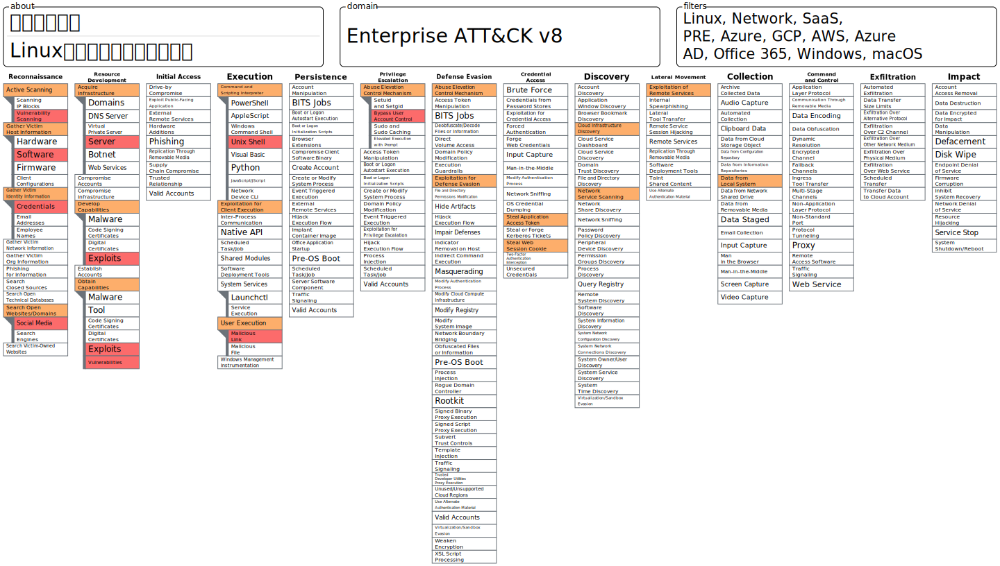
### 基于 ATT&CK 的攻击路线图


### 完整攻防图
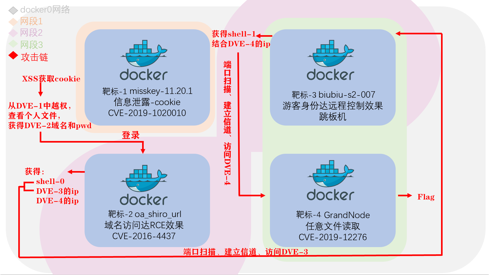

## Ⅶ 指导总结
|指导阶段|指导时间|工作内容|完成情况|
|----|----|----|----|
|第一阶段|2020-12-01 —— 2020-12-31|、|100%|
|第二阶段|2021-01-01 —— 2021-02-07|四台靶机虚拟化部署|100%|
|第三阶段|2021-02-15 —— 2021-02-28|靶场网络连通与隔离|100%|
|第四阶段|2021-03-01 —— 2021-03-31|威胁模拟工具设计与运行|100%|
|第五阶段|2021-04-01 ——2021-04-14|基于ATT&CK的攻击路线图和攻击要点图绘制|100%|
|第六阶段|2021-04-15 —— 2021-05-11|毕业论文写作，结项答辩|100%|

## Ⅷ 同学的毕设

[朱妍欣同学的毕设](https://github.com/YanhuiJessica/Attack-Seaman):实现了知识库的可视化编辑和一键发布。  

* Attackpatterns:用于增加tactics、techniques、sub-techniques
* Relationship:用于关联tactics、techniques、sub-techniquesd的关系
* 初始化数据来源:[不同版本的enterprise/mobile的Attack知识库文件](https://github.com/mitre/cti/)
* 基于[ATT&CK Navigator](https://github.com/mitre-attack/attack-navigator#Install-and-Run),修改了数据文件，重新部署了json文件，用golang编写后端把文件放上去，使用[reactadmin框架](https://github.com/Liberxue/ReactAdmin)和mongodb
* 只有矩阵的个性化编辑，没有进一步的procedures等细节内容
* 必要性：由于att&ck只是一个抽象且标准的框架，而对于针对性较强的攻防环境需要更为细节和特征化的矩阵图

## Ⅸ 2022-2补充
### [MITRE ATT&CK for ICS](https://www.armis.com/white-papers/comprehensive-coverage-for-mitre-attck-for-ics/?utm_medium=paid-search&utm_source=google-search&utm_content=&utm_term=mitre%20attack%20techniques_p&utm_campaign=OT-Americas-EN-Search-Lead_Gen&sfdcid=7011n0000007tMHAAY&gclid=EAIaIQobChMIuNC69IWQ9gIVfWxvBB0RdAWWEAAYASAAEgJjp_D_BwE)工控安全的ATT&CK框架
>白皮书：papers/Armis_MITRE_ATTACK_Definitive-EngenuityGuide-SB.pdf

2020.1，ATT&CK系列框架中出现了新的框架：MITRE ATT&CK for ICS
### ATT&CK落地方案
>paper/10-ways-to-take-the-mitre-att-and-ck-framework-from-plan-to-action.pdf
### 市场上融合了ATT&CK的产品
#### [ARMIS](https://www.armis.com/armis-platform/)
* [ARMIS-demo](https://www.armis.com/demo/)(还没有得到)

结合了ATT&CK,能够对内部控制系统（ICS）和操作技术环境（OT）进行检测，能明确给出检测到了ATT&CK框架中的哪些技术短语

#### [XM Cyber](https://www.xmcyber.com/)
基于SaaS的平台,Breach and Attack Simulation​入侵和攻击模拟，
#### Infection Monkey
### 毕设改进之一
对于毕设中的路线图，排除特定的测试环境而言，不如说下图这样的路线图更好，因为给出了攻击的更多可能性，可以给防御者更好的改进思路。   
（[图片来源](https://www.f5.com/labs/articles/education/mitre-attack-what-it-is-how-it-works-who-uses-it-and-why),这篇文章也给出了根据攻击手段的有效性或重要性进行不同颜色的标注，此外，ATT&CK是有针对APT攻击的）
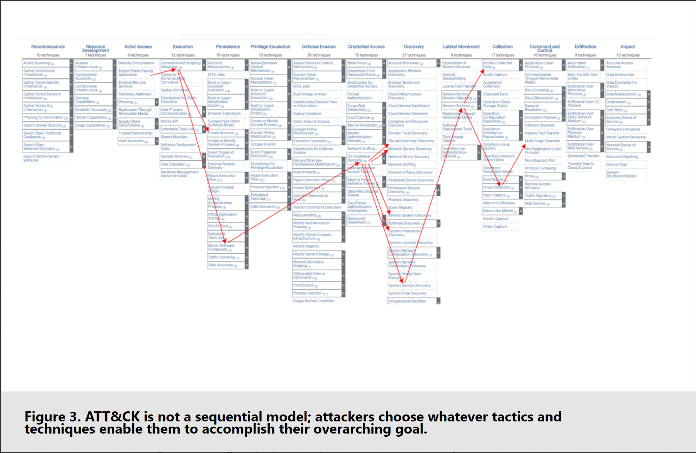
### [红队 蓝队 紫队 老虎队](https://www.emagined.com/red-team-and-blue-team)
purple team:同时具有进攻和防御的思想，旨在确保整体和协同操作以及攻击者和公司防御者之间的信息交换。  
tiger team:针对特别问题。  
根据Lockheed Martin's Cyber Kill Chain，红队的攻击完整攻击流程：  
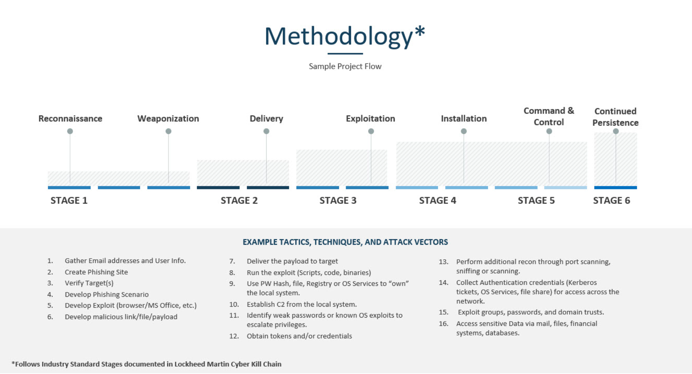 
红队测试工具如下：
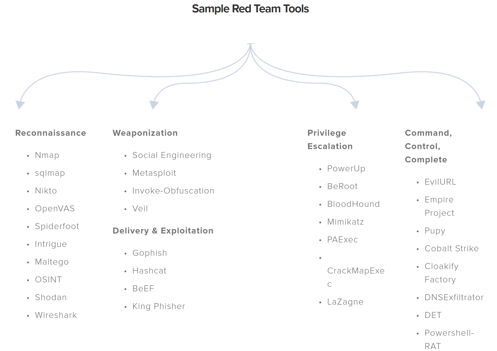
蓝队应该具备的功能或SOC完整的服务流程：
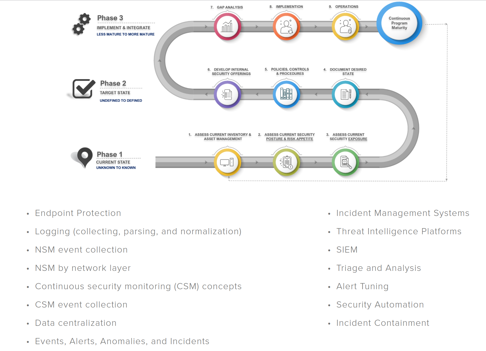
蓝队测试工具如下：
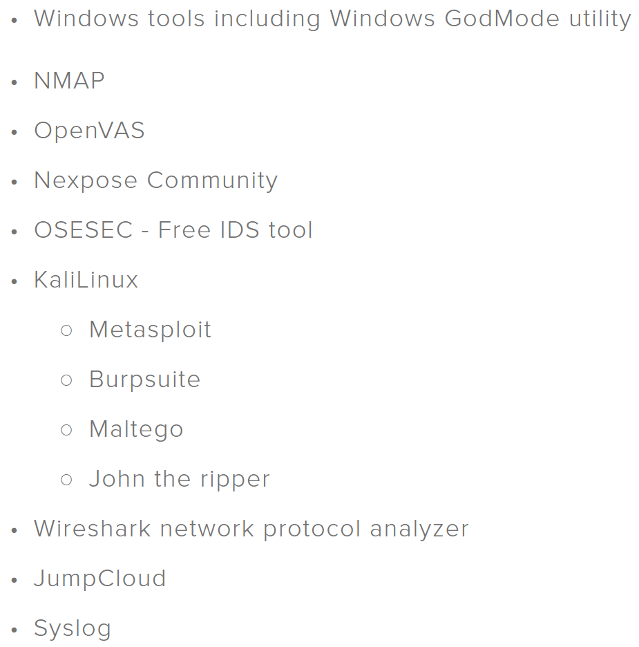
红蓝队对比总结：  
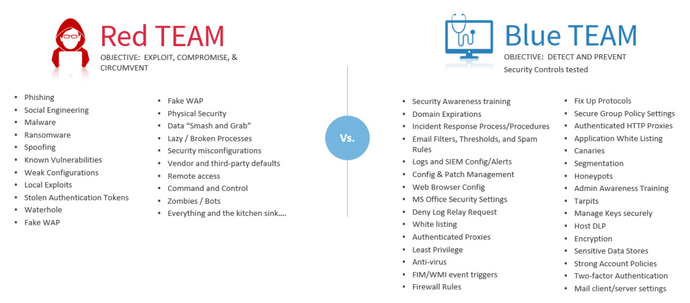


