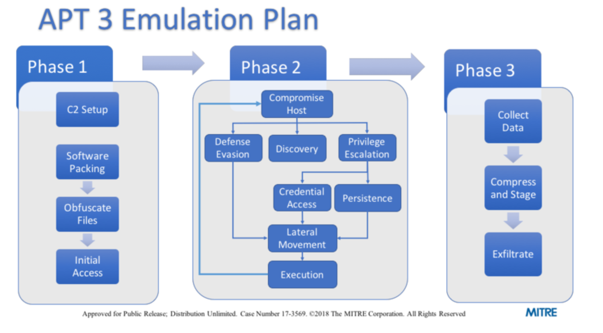

# graduation-project
## 题目：Linux 威胁模拟工具设计与实现---攻击方环境测评系统

Design and Implementation of Linux Red Team Adversary Emulation Tools

在传统的网络攻防演练活动中，攻防演练双方要么在一个「第三方」搭建的仿真演练平台、要么直接在真实网络系统环境中展开一场模拟真实网络攻防活动的演练活动，这种演练方式的优点在于「高仿真性」，缺点在于对于防御方的能力检验「仿真性」程度高低很大程度上取决于攻击方的「攻击能力」高低。ATT&CK 知识库的出现使得对于特定威胁类型和手段的模拟有了标准化描述，这使得对于防御方的能力检验「仿真性」保证从依赖于攻击方「攻击能力水平」转为依赖于标准化威胁模拟方案。只要基于标准化的方案开发不同的标准化模拟工具，就能逐渐摆脱目前网络攻防演练中缺少高水平攻击队的困境，使得防御方能在「高仿真水平」环境中完成防御能力训练和检验。

本课题聚焦于面向 Linux 网络攻防演练活动中的威胁模拟工具设计与实现，预期完成至少一个已公开安全事件报告中的攻击方模拟工具，并基于此攻击方模拟工具完成若干威胁检测能力算法或工具的横向测评实验。

对学生的要求：本课题的实施需要学生具备 Linux 环境下的渗透测试工具使用能力和 Linux 工作环境代码部署和运维经验，了解编写 Suricata 和 Bro/Zeek 等知名开源流量分析与入侵检测系统的检测插件方法。

### 开题
#### 题目分析：玩一次左右互博的游戏
解释：假设我们新开发了一个安全产品或搭建了一个自认为安全的网络（诸如此类，在此称之为"保护对象"），在"保护对象"投入市场前，已经有针对我们当前这个"保护对象"的同类做出的攻击行为，因此，先给"保护对象"制作一个基于历史攻击行为的完备防御护罩，再投入市场。   
模拟运行一个攻击方工具，假设我们会被它攻击，在此基础上"像一个攻击者一样"反向思考，即这个攻击方如何攻击我们就如何率先防御，去评估产品的安全性，进行威胁建模（具体的是要完成若干威胁检测能力算法或工具的横向测评实验），从而实现在产品投入市场之前就已经对当前产品做了先知性的防御准备。该毕设在市场应用中属于安服行业。
#### 题目要求
- [] 模拟运行攻击方工具，明确其工作方式原理，测试防御方防御能力。
- [] 熟悉ATT&CK框架，利用Suricata和Bro/Zeek写威胁检测脚本。
- [] 进阶非必要，熟悉ids编写原理，甚至写一个自己的ids，完成一个较为成熟的威胁建模。
#### 研究背景
* 参考文献：  
[Red versus blue:the battle of IT security](https://advantage.nz/red_blue_article/)    
[Cybersecurity Red Team Versus Blue Team — Main Differences Explained](https://securitytrails.com/blog/cybersecurity-red-blue-team)  

随着互联网的发展，个人隐私、企业隐私、政府隐私等保密安全需求的扩大，市面上的安全产品也越来越多。无论是一个搭建的网络、开发的软件还是研发的系统，所有互联网相关的产品在其生命周期内都有被黑客攻击的危险。  
有攻就有防，在遭受许许多多无数次的攻击后，开发者也会不断总结经验，变得警觉起来，在产品投入市场被黑客达成“筛子”之前，提前给产品做好一个预先的“金钟罩”。因此，MITRE创建了ATT&CK网络攻击行为知识库，这个知识库在更多白帽子们的协助下逐渐丰富起来。这个知识库回答了攻击者可能有哪些攻击行为，针对每一种攻击，作为防御者可以如何缓解或解决，以及如何检测是否遭受这样的攻击，为开发商和防御者们提供了非常好的模板。  
为了进一步预测攻击者的行为，产生了对抗模拟构建一个场景来测试对手的战术、技术和过程的某些方面。从而使红队更积极地模拟对手的行为，也让防御者蓝队更有效地测试他们的网络和防御，以帮助更有效地测试产品和环境。

#### 研究现状
1.ATT&CK(Adversarial Tactics, Techniques, and Common Knowledge )
定义：网络攻击行为知识库，反映入侵者生命周期各个阶段的攻击行为，回答了攻击者可能有哪些攻击行为，针对每一种攻击，作为防御者可以如何缓解或解决，以及如何检测是否遭受这样的攻击。  
意义：ATT&CK尽可能从公开的威胁情报和事件报告中，总结在软件生命周期内会遭受到的网络攻击行为。也称框架framework，因为它对于一些攻击行为有基础的防御流程。分为针对企业IT网络和云的攻击防范（ATT&CK for Enterprise）和针对移动设备的攻击防范（ATT&CK for Mobile）。方便防御者分类攻击和进行风险评估。    
作用：目前私人企业、政府以及网络安全产品和服务社区的特定威胁模型和方法都是以ATT&CK知识库为基础开发起来的具体或特定的威胁模型。  
特点：半年更新一次，具有时效性；内容较为全面，支持他人贡献；免费开放  
   
使用场景：
* 入侵者模拟
* 红队
* 行为分析开发
* 防御性缺口评估
* SOC成熟度评估
* 网络威胁情报丰富化 

中层模型
* High Level:[Lockheed Martin Kill Chain](https://www.lockheedmartin.com/en-us/capabilities/cyber/cyber-kill-chain.html) & Microsoft STRIDE
   * 宏观、流程、目标

* Mid-level Model:[Mitre ATT&CK]()
   * 提供了非常详细和不断更新的技术信息，比如何种操作、操作之间的关系、操作序列，优点就在于有上下文
* Low Level Concepts:Exploit & Vulnerability database & models
   * 具体实例，但缺少对使用者和上下文的描述

2.威胁建模原理
* [威胁建模-msdn](https://docs.microsoft.com/zh-cn/learn/modules/tm-introduction-to-threat-modeling/1-introduction)  

四大步骤：设计---中断---修复---验证
* 设计阶段目标---知道系统的工作方式，确定从云提供商和集成服务继承的安全要求、保证或差距。：  
1.清楚地了解系统的工作原理  
2.列出系统使用的每个服务
3.枚举有关环境和默认安全配置的所有假设
4.使用正确的上下文深度级别创建数据流关系图
* 中断阶段目标---通过相关框架选择重点领域，以系统地识别系统中的潜在威胁：
1.选择以“保护系统”或“了解攻击者”为核心的方法，即确定侧重点是系统、攻击者还是资产，从而明确保护对象，进一步明确潜在威胁。
2.使用 STRIDE 框架（欺骗、篡改、否认性、信息泄露、拒绝服务、权限提升）识别常见威胁
* 修复阶段目标---生成并验证一系列安全控制，设置优先级，以减轻或消除风险：  
1.根据优先级框架或安全 bug 栏衡量每个威胁的优先级（影响、严重性、风险）  
2.在 bug 管理服务中将每个威胁作为任务或工作项进行跟踪  
3.生成对应于 STRIDE 威胁的安全控制建议  
4.选择一项或多项安全控制类型和功能来应对每个威胁（评估威胁有效性和成本）  
5.解决任务    
* 验证阶段目标---针对先前产生的威胁手动或自动验证系统，以验证安全控制是否降低或消除了风险：  
1.确认系统满足所有新旧安全要求（比如网络安全计划、机密管理解决方案实施、日志记录和监视系统、标识和访问控制）  
2.配置云提供商、操作系统和组件以满足安全要求  
3.确保使用正确的安全控制解决所有问题  
4.在部署前对系统进行手动和自动验证  

3.Suricata
* 参考文献：[Suricata](https://suricata-ids.org/)

4.Bro/Zeek
* 参考文献：[Bro/Zeek3.0.0](https://zeek.org/category/bro/)

5.IDS(Intrusion Detection System)  
* 参考文献：  
[Intrusion Detection System](https://de.wikipedia.org/wiki/Intrusion_Detection_System)  
[Open Source IDS Tools: Comparing Suricata, Snort, Bro (Zeek), Linux](https://www.open-source.me/open-source-ids-tools-comparing-suricata-snort-bro-zeek-linux/)

ids检测技术分为基于签名的检测系统、基于异常的检测系统、基于网络的入侵检测系统、基于主机的入侵检测系统。
* 基于签名的检测：  
一旦找到与签名匹配的内容，就会向管理员发送警报。
* 基于异常行为的检测：  
由于异常行为生成流量的活动比交付的有效负载重要的得多，此种检测依赖于基线（先前活动的统计平均值或先前看到的活动），一旦偏离就会发送警报。
* 基于签名的检测VS基于异常行为的检测（最原始的两种）：  
1.两种技术都是相同的方式部署，可以从外部收集netflow数据或类似的流量信息来观察。  
2.基于签名的检测出现的误报更少，但只有已知的签名被标记，为新的和尚未被识别的威胁留下了一个安全漏洞。基于异常的检测会出现更多误报，但如果配置正确，它会捕获以前未知的威胁。
* 基于网络的入侵检测系统(NIDS)：  
通过检测一个网段上的所有流量来检测恶意活动。通过NIDS，通过镜像流量交叉交换机和/或路由器，通过网络传输流量的副本被发送到NIDS设备。
NIDS设备监控并警报流量模式或特征。当恶意事件被NIDS设备标记时，重要信息被记录下来。为了知道事件的发生，需要监视这些数据。通过将这些信息与从其他系统和设备收集的事件相结合，您可以看到您的网络安全状况的完整画面。注意，这里的工具都不能单独关联日志。这通常是安全信息和事件管理器(SIEM)的功能。
* 基于主机的IDS (HIDS)：  
基于主机的入侵检测系统(HIDS)通过监视端点主机内部发生的活动来工作。HIDS应用程序(例如杀毒软件、间谍软件检测软件、防火墙)通常安装在网络内所有联网的计算机上，或安装在服务器等重要系统的子集上。这包括那些在公共云环境中的。
HIDS通过检查操作系统创建的日志、查找对关键系统文件的更改、跟踪已安装的软件，有时还检查主机的网络连接，来搜索不寻常或不法的活动。
第一个HIDS系统是基本的，通常只是在重复的基础上创建MD5文件散列，并利用称为文件完整性监视(FIM)的过程寻找差异。从那时起，HIDS变得更加复杂，并执行各种有用的安全功能，而且还将继续增长。这包括现代端点响应(EDR)功能。  

目前成熟的入侵检测系统对比（列举部分特点）：
* Suricata：可以使用相同的签名；多个线程；跨平台支持。  
* Bro/Zeek:既是签名又是基于异常的ids；没有本地GUI，但是有第三方开放源码工具可供web前端查询和分析来自Bro ids的警报；强大而灵活的事件驱动脚本语言(Bro脚本)；部署在unix风格的系统上，包括Linux、FreeBSD和MacOS。  
* snort：没有真正的GUI或易于使用的管理控制台，其他开放源码工具(如BASE和Sguil)来提供帮助。这些工具提供了一个web前端，用于查询和分析来自Snort id的警报；单个线程运行。
* OSSEC：属于HIDS；Rootkit检测，它搜索类似于Rootkit的系统修改；
* Samhain Labs：属于HIDS；难安装；  
  
  * OSSEC VS Samhain Labs:  
  都是客户机/服务器架构。但Samhain Labs代理有多种输出方式，比如中央日志存储库、Syslog、电子邮件、RDBMS、也可以选择将Samhain作为单个主机上的独立应用程序使用。与OSSEC不同，Samhain Labs处理发生在客户端本身，避免了服务器超载而干扰操作。

6.Adversary emulation：对抗模拟构建一个场景来测试对手的战术、技术和过程(TTPs)的某些方面。
* 参考文献：  
[Adversary Emulation Plans](https://attack.mitre.org/resources/adversary-emulation-plans/)  
[List of Adversary Emulation Tools](https://pentestit.com/adversary-emulation-tools-list/)
[APTSimulator：一款功能强大的APT模拟攻击工具集](https://www.freebuf.com/sectool/164236.html)
常用的模拟对抗工具及其特点（部分列举）： 
开源攻击模拟工具：   
* ATP Simulator:其实就是一套Windows Batch脚本集合，仅限Windows的解决方案。
* Red Team Automation:提供50种由ATT＆CK技术支持的组件。
* Metta使用Redis/Celery，python和VirtualBox进行敌对模拟，这样用户就可以测试基于主机的安全系统。另外用户还能测试其他基于网络的安全检测和控制，不过这具体取决于设置的方式。Metta与Microsoft Windows，MacOS和Linux端点兼容。
* Invoke-Adversary：Invoke-Adversary是一个基于APT攻击程度，来评估安全产品和监控解决方案的PowerShell脚本。攻击模拟领域的新人，微软的调用攻击就是一种PowerShell脚本。可能是受到了APT模拟器的启发，截至目前，Invoke-Adversary具有测试持久性攻击、凭证访问、逃避检测、信息收集、命令和控制等功能。
* Atomic Red Team：它是针对安防设计的新型自动化测试框架，因为它可以作为小型组件，方便小型或大型安全团队使用，用来模拟特定攻击者的活动。
* Infection Monkey：Infection Monkey是一款由以色列安全公司GuardiCore在2016黑帽大会上发布的数据中心安全检测工具，其主要用于数据中心边界及内部服务器安全性的自动化检测。该工具在架构上，则分为Monkey（扫描及漏洞利用端）以及C&C服务器（相当于reporter，但仅仅只是用于收集monkey探测的信息）。简单说，它是另一个开源漏洞和攻击模拟工具。它也用Python编码，适用于Microsoft Windows和Linux系统。
企业级模拟攻击工具：  
* Cobalt Strike：Cobalt Strike是Armitage商业版，Armitage是一款Java写的Metasploit图形界面的攻击软件，可以用它结合Metasploit已知的攻击来针对存在的漏洞自动化攻击  
* Cymulate：Cymulate主要是针对以下场景进行攻击模拟，例如模拟攻击WAF、模拟攻击邮箱、DLP攻击测试、SOC模拟测试、邮箱测试、勒索软件测试、木马、Payload渗透攻击测试等。这类测试的主要目的是完善产品、丰富员工的安全意识，以及相应的攻击技术能力检测和提升。举个例子，利用邮箱以及可以统计钓鱼攻击有多少用户中招。
* Immunity Adversary Simulation:该平台允许你从基础架构内建立高级永久性攻击模型，并评估安全团队如何应对网络上活跃的真实攻击。
7.威胁建模要点及步骤
威胁建模要点：
* 参考[ATT&CK FAQ](https://attack.mitre.org/resources/faq/)
* tactics:(以短语的形式笼统描述)攻击的理由或目标。包括Initial Access、Execution、Persistence、Privilege Escalation、Defense Evasion、Credential Access、Discovery、Lateral Movement、Collection、Exfiltration、Impact
* techniques:攻击者采用什么手段来达到战术目标(笼统)
* sub-techniques:攻击者采用什么具体手段一步步达到该目标。(具体)
* procedures:攻击者使用什么样的程序或代码去实现子技术。
   * 技术、子技术都是行为分类后的简称，程序才是具体实施
* mitigations:预防措施
* detection:
威胁建模步骤：   
* 参考文献：[Getting Started with ATT&CK: Adversary Emulation and Red Teaming](https://medium.com/mitre-attack/getting-started-with-attack-red-29f074ccf7e3)
1. Choose an ATT&CK technique  
2. Choose a test for that technique  
3. Execute the test procedure  
4. Analyze your detections of the procedure  
5. Make improvements to your defenses
8. 威胁情报标准：从事后（被动）防御变为主动防御
必要性：降低攻击向量的重复利用率，提供自动化、快速、预先性的防御。
成熟的威胁情报标准：
* [Cybox](https://cyboxproject.github.io/):Cyber Observable eXpression,网络可观测表达式，用以描述可观察对象的网络动态和实体的框架/结构。
  * 可观察的对象可以是动态的事件，也可以是静态的资产，比如http会话，X509证书、文件、系统配置项等。
  * 已整合到STIX2.0中
  

* [STIX](https://stixproject.github.io/):Structured Threat Information eXpression,结构化威胁信息表达式,基于边缘和节点的图形数据模型。
  * 节点：SDO,STIX Data Objects,STIX数据对象，包括攻击模式、身份、观察到的数据、威胁行为者、安全漏洞等
    * 18种
  * 边缘：SRO，STIX RelationshipObjects,STIX关系对象
    * 包括relationship和sighting
  * json和python两种实现方式（Python仅支持STIX2）
  * TAXII用来传输数据，STIX用作情报分析

* [TAXII](https://taxiiproject.github.io/):Trusted Automated eXchange of Indicator Information,指标信息的可信自动化交换协议，为用户和安全供应商之间提供可靠的、自动化的网络威胁信息交换。
  * 无需考虑拓扑结构、信任问题、授权管理，转交给更高级别的协议和约定考虑
  * 支持多种共享模型，比如hub-and-spoke、peer-to-peer、subscribern等
  * 定义在Http/Https的request/response包中，有模板
  * 提供四种服务：
     * inbox service:a TAXII client push informatuion to a TAXII Server.
     * poll service:a TAXII client request informatuion to a TAXII Server.
     * Collection Management Service:Used by a TAXII Client to request information about available Data Collections or request a subscription.(Data Collections分为有序（Data Feed）和无序（Data Set))
     * Discovery Service:Used by a TAXII Client to discover available TAXII Services (e.g., “An Inbox Service is located at http://example.com/inbox_service”).
  * 数据分发有collection和channel两种方式:
   

* [MAEC](https://maecproject.github.io/):Malware Attribute Enumeration and Characterization,恶意软件特征枚举和分类
  * 提供一个公认的标准来描述恶意软件，用于根据行为、工件和恶意软件样本之间的关系等属性编码和共享关于恶意软件的高保真信息。
  * 三大部分：
    * 恶意软件分析：使用已存恶意软件的相关性，集成且自动化地，使用动态和静态分析，形成MAEC包（概要文件），减少研究人员欸一软件分析工作的重复，且便于更快地开发对策。
      * [未来会有恶意软件的可视化工具](https://maecproject.github.io/documentation/use_cases/malware_analysis/malware_visualization/)
      * MAEC作为一种通用的中间层，用于不同恶意软件存储库模式之间的映射，从而使得不同存储库中的分析信息可以共享，允许团队或组织快速利用彼此的分析结果。而且，MAEC还可以对恶意软件属性结构化和标记，进一步改进数据挖掘。比如，分析师可以查询基于MAEC的恶意软件存储库，进一步查找恶意软件动作、行为或能力的实例。
      * 针对MAEC结构的标准化输出工具：[Utilities & Developer Resources](https://maecproject.github.io/documentation/utils/)
      * 其中的分析得到的malware behavoir独立为一个project,[MBC（Malware Behavoir Catalog）](https://github.com/MBCProject/mbc-markdown)映射到了Cuckoo community signatures和capa rules中进行使用,以及STIX2中。
    
    * 网络威胁分析：MAEC对恶意软件实例显示的能力进行标准化编码，从而准确识别恶意软件对组织及其基础设施构成的威胁。
      * 建立MAEC图形化数据模型来表示恶意软件家族的演变。建立MAEC实体之间的顶级关系来建模，从而可以追踪恶意软件的血统。关于顶级关系建模，使用MAEC为恶意软件实体和家族定义标准属性（比如字符串）来作为关联的要素。
      * 根据恶意软件的属性来关联攻击者和恶意软件工具集
      * 会对恶意软件进行评分
    * 事件整理：基于MAEC数据模型，使用统一的恶意软件报告格式进行描述，从而标准化恶意软件存储库，然后关联事件来管理，增强了与恶意软件相关的事件管理工作。
      * 使用统一恶意软件报告格式：避免当前市面上的报告都是自由格式且排除了有助于缓解恶意行为危害和分析恶意行为目的的缺陷，对恶意软件进行准确的和明确的报告，减少对恶意软件威胁本质的混淆，提供了额外的功能，比如基于机器的操作和自动获取恶意报告数据。
      * 不同恶意软件存储库互相映射，共享存储。
      * 修复：基于整理的恶意软件存储库，能够提供能完整的补救措施，提高系统未来的稳定性。（因为，大多数传统的反病毒工具和实用程序都不能清除检测到的恶意软件实例的每一个痕迹。即使从系统中清除了感染的显式恶意部分，而且恶意部分并不总是能完全清楚，其余部分也可能在未来的扫描中导致误报，潜在地导致补救资源的错误分配）
   
   
  

MITRE：Malware Attribute Enumeration and Characterization，
* [CAPEC](https://capec.mitre.org/index.html):攻击模式的字典
  * 与CWE有关
  * 检索的两种方式：Mechanisms of Attack + Domains of Attack
  * Mechanisms of Attack:
    * Engage in Deceptive Interactions
    * Abuse Existing Functionality
    * Manipulate Data Structures
    * Manipulate System Resources
    * Inject Unexpected Items
    * Employ Probabilistic Techniques
    * Manipulate Timing and State
    * Collect and Analyze Information
    * Subvert Access Control
  * Domains of Attack:
    * Software
    * Hardware
    * Communications
    * Supply Chain
    * Social Engineering
    * Physical Security
* OVAL：Open Vulnerability and Assessment Language,
#### Infection Monkey-An Automated Pentest Tool 
* 主要针对于数据中心边界及内部服务器安全的检测
* 参考文献：  
[威胁建模模型ATT&CK](https://www.freebuf.com/articles/network/197837.html)  
[infectionmonkey](https://www.guardicore.com/infectionmonkey/)
[Infection Monkey：数据中心边界及内部服务器安全检测工具](https://www.freebuf.com/sectool/113745.html)

Introduction  
The Infection Monkey is an open source security tool for testing a data center’s resiliency to perimeter breaches and internal server infection. The Monkey uses various methods to self propagate across a data center and reports success to a centralized Monkey Island Command and Control server.    
The Infection Monkey is comprised of two parts:  
Monkey - A tool which infects other machines and propagates to them.  
Monkey Island - A dedicated UI to visualize the Infection Monkey’s progress inside the data center.  
感染猴是一个开源的安全工具，用于测试数据中心对周边攻击和内部服务器感染的弹性。Monkey使用各种方法在数据中心中自我传播，并将成功报告给集中式的Monkey Island命令和控制服务器。
受感染的猴子由两部分组成:
猴子-一种感染其他机器并向它们传播的工具。
猴子岛——一个专用的UI，用于可视化受感染的猴子在数据中心内的进展。

Points  
The Infection Monkey is an open source Breach and Attack Simulation (BAS) tool that assesses the resiliency of private and public cloud environments to post-breach attacks and lateral movement.
#### 工作量证明（三个月完成）
1.题目的解读以及大量理论知识的学习和储备是必要的，一个月的准备时间（自2020.11开始，目前已完成）
2.确定具体的模拟攻击方工具的环境搭建以及基本使用由于具有官方文档或前人使用经验，一周可以完成。
3.根据官方手册熟悉该攻击方工具的攻击特点需要一些时间，一周可以熟悉该攻击方工具。
4.ATT&CK知识库内容庞杂，针对攻击方工具的攻击特点，归类出攻击类型,确定防御面并找出相应的防御框架需要一定的时间，两周完成。
5.在确定的防御框架下进行威胁建模并使用，尽量不断完善，三周完成。
6.剪辑实验过程视频以及准备一份详尽的毕设实验报告，一周完成。
#### 可行性证明---我能做出来
##### 外部条件
* 有ATT&CK免费开放提供编写ids的基础防御框架
* 市场上已经有很多非常成熟被大多数人所认可的ids可以模仿或借鉴,比如Suricata、Bro/Zeek、snort、OSSEC、Samhain Labs。
* github上也有许多正在开发或新研发出的ids可供借鉴学习。

##### 自我能力
- 对于题目具有清晰的认识和准确的理解。
- 对于题目完成已具备充足的理论知识储备。
- 该同学自学能力和动手能力强。
- 具备渗透测试基础能力，使用过webgoat、juicyshop、dvwa等渗透测试平台，清晰owasp top10原理。
- 具备linux部署的能力，曾使用ansible、cloud-init、docker在linux环境中进行部署。
- 清晰必备网络协议的知识，比如TCP/IP协议，HTTP协议，清楚OSI七层模型和TCP/IP四层模型。
- 具备编程能力，熟练掌握Python，曾使用scapy、nmap编写过端口扫描的代码，从而实现对恶意可执行文件的流量检测。会写shell脚本。
- 会使用渗透测试必备工具，比如Burpsuite、wireshark、tcpdump。
- 会使用PE Explorer、Process Explorer以及查看注册表等方法，观察恶意可执行文件的异常行为。
- 会使用cuckoo对恶意软件进行黑盒测试，会使用IDA Pro、Ollydbg对恶意软件进行白盒分析。
- 大三上学期网络安全课程中使用过snort插件自主完成了ns-chap0x09信息收集和入侵检测的实验，对于ids有一个基础印象。
#### 创新性说明
##### 竞品调研
网上仅仅具备威胁建模的理论知识，Github上没有搜索到实际项目、google上也没有搜索到前人做出的成熟的威胁建模报告。因此，这个毕设的内容十分具有创新性。
#### 研究意义
对抗模拟的学习对于我们学网络安全、热爱技术、热爱攻防的同学来说是必不可少的，无论我们以后走向了红队还是蓝队，都能提高我们的能力。即使我们退出一线技术岗，转向了安全服务，我们依然面临着要对产品进行风险评估，或者针对目标产品研发威胁建模的问题。  
威胁建模属于安服，目前许多网络安全行业的创业公司是做安全服务的（包括威胁建模、安全需求分析、安全设计等）。各个公司针对自己目标的产品进行威胁建模有成熟的产品和产业链，但是都不是开源的，因为基本上能成功的威胁建模就可以养活一个小公司。  
因此，这个毕设非常有趣，值得研究。通过本次毕设研究，既可以能扩宽自己的知识面，也能增强自己的动手能力，更能提高作为网络安全小白帽的素养，是一次锻炼自己的好机会。
#### 当前进展
清晰了题目要求，具备了理论知识，确定了要使用的对抗模拟工具是infectionmonkey，还没有开始着手进行实践。

#### 预期成果
1.完整实验演示录屏（包括模拟工具的安装使用+攻击方模拟运行+威胁建模过程+防御措施使用过程及最终效果）
2.威胁建模的代码或工具
#### 参考文献
[ATT&CK](https://attack.mitre.org)

## 实验进展
### 实验要求
- [] 模拟运行攻击方工具，明确其工作方式原理，测试防御方防御能力。
- [] 熟悉ATT&CK框架，利用Suricata和Bro/Zeek写威胁检测脚本。
- [] 进阶非必要，熟悉ids编写原理，甚至写一个自己的ids，完成一个较为成熟的威胁建模。

- [] 借助攻击方模拟工具，完成自动化/半自动化的内网渗透/信息收集/资产获取
- [] 模拟运行一个攻击方工具
- [] 搭建一个内网环境
- [] 使用攻击方工具进行内网渗透/信息收集/资产获取
### 实验成果
- [] 完整实验演示录屏（包括模拟工具的安装使用+攻击方模拟运行+威胁建模过程+防御措施使用过程及最终效果）
- [] 威胁建模的代码或工具

### 实验环境
ubuntu 16.04 TLS amd64
### 实验步骤
##### 一、模拟运行[Infection Monkey](https://www.guardicore.com/infectionmonkey/)
1. 安装下载docker
* 参考[Install Docker Engine on Ubuntu](https://docs.docker.com/engine/install/ubuntu/)

```
1. Update the apt package index and install packages to allow apt to use a repository over HTTPS:
$ sudo apt-get update

$ sudo apt-get install \
    apt-transport-https \
    ca-certificates \
    curl \
    gnupg-agent \
    software-properties-common

2. Add Docker’s official GPG key:
$ curl -fsSL https://download.docker.com/linux/ubuntu/gpg | sudo apt-key add -

# Verify that you now have the key with the fingerprint 9DC8 5822 9FC7 DD38 854A  E2D8 8D81 803C 0EBF CD88, by searching for the last 8 characters of the fingerprint.

$ sudo apt-key fingerprint 0EBFCD88
# pub   rsa4096 2017-02-22 [SCEA]
#       9DC8 5822 9FC7 DD38 854A  E2D8 8D81 803C 0EBF CD88
# uid           [ unknown] Docker Release (CE deb) <docker@docker.com>
# sub   rsa4096 2017-02-22 [S]

4. Use the following command to set up the stable repository. To add the nightly or test repository, add the word nightly or test (or both) after the word stable in the commands below. Learn about nightly and test channels.
amd64:  
$ sudo add-apt-repository \
   "deb [arch=amd64] https://download.docker.com/linux/ubuntu \
   $(lsb_release -cs) \
   stable"

5. Update the apt package index, and install the latest version of Docker Engine and containerd, or go to the next step to install a specific version:
 $ sudo apt-get update
 $ sudo apt-get install docker-ce docker-ce-cli containerd.io

```
* 执行```sudo apt-get install docker-ce docker-ce-cli containerd.io```时出现报错:'Unable to locate package `docker-ce` on a 64bit ubuntu'。参考[Unable to locate package `docker-ce` on a 64bit ubuntu](https://unix.stackexchange.com/questions/363048/unable-to-locate-package-docker-ce-on-a-64bit-ubuntu)执行：
```
sudo apt-get install apt-transport-https ca-certificates curl software-properties-common
curl -fsSL https://download.docker.com/linux/ubuntu/gpg | sudo apt-key add -
sudo add-apt-repository "deb [arch=amd64] https://download.docker.com/linux/ubuntu xenial stable"

sudo apt update
apt-cache search docker-ce
sudo apt-get install docker-ce docker-ce-cli containerd.io
```
2. install docker-compose
```
sudo curl -L "https://github.com/docker/compose/releases/download/1.24.0/docker-compose-$(uname -s)-$(uname -m)" -o /usr/local/bin/docker-compose

sudo chmod +x /usr/local/bin/docker-compose
sudo ln -s /usr/local/bin/docker-compose /usr/bin/docker-compose
docker-compose --version
docker-compose version 1.15.0, build e12f3b9

```
问题：
1. ```docker-compose --version```的结果是```docker-compose version 1.8.0, build unknown```
参考[unable to build docker-compose build](https://stackoverflow.com/questions/45978035/unable-to-build-docker-compose-build)  
解决：
```
sudo apt-get purge docker-compose
sudo curl -o /usr/local/bin/docker-compose -L "https://github.com/docker/compose/releases/download/1.15.0/docker-compose-$(uname -s)-$(uname -m)"
sudo chmod +x /usr/local/bin/docker-compose
sudo ln -s /usr/local/bin/docker-compose /usr/bin/docker-compose
docker-compose --version
docker-compose version 1.15.0, build e12f3b9
```
2. 执行```docker-compose up```时报错
```
ERROR: Couldn't connect to Docker daemon at http+docker://localunixsocket - is it running?
If it's at a non-standard location, specify the URL with the DOCKER_HOST environment variable.
```

2. 从[Infection Monkey](https://www.guardicore.com/infectionmonkey/)官网上下载得到monkey-island-docker.tar.gz。使用scp拷贝到虚拟机当中。解压得到dk.monkeyisland.1.9.0.tar。 

3. Deployment
```
sudo docker load -i dk.monkeyisland.1.9.0.tar
sudo docker pull mongo
sudo mkdir -p /var/monkey-mongo/data/db
sudo docker run --name monkey-mongo --network=host -v /var/monkey-mongo/data/db:/data/db -d mongo
sudo docker run --name monkey-island --network=host -d guardicore/monkey-island:1.9.0

```
* 执行'sudo docker pull mongo'时报错：'Error response from daemon: Head https://registry-1.docker.io/v2/library/mongo/manifests/latest: Get https://auth.docker.io/token?scope=repository%3Alibrary%2Fmongo%3Apull&service=registry.docker.io: net/http: TLS handshake timeout'。  
参考[ERROR: Get https://registry-1.docker.io/v2/: net/http: TLS handshake timeout in Docker](https://stackoverflow.com/questions/52252791/error-get-https-registry-1-docker-io-v2-net-http-tls-handshake-timeout-in),重启docker```sudo systemctl restart docker```解决。

* 执行'sudo docker pull mongo'时docker pull太慢，参考[Docker下载镜像太慢问题](https://www.cnblogs.com/spll/p/11828193.html)
```
sudo vim /etc/docker/daemon.json

{
  "registry-mirrors":["https://almtd3fa.mirror.aliyuncs.com"]
}

service docker restart
```
4. Usage
访问https://<server-ip>:5000  

注册用户名和密码后，进入使用页面  


##### caldera
```
git clone https://github.com/mitre/caldera.git 
pip install -r requirements.txt

pip install aiohttp
pip install aiohttp_jinja2
pip install aiohttp_security
pip install aiohttp_session
pip install idap3
pip install marshmallow_enum
```
* AttributeError: module 'marshmallow' has no attribute 'INCLUDE'
```
python server.py
```
##### Suricata
```
sudo apt-get update
sudo apt-get install libpcre3-dbg libpcre3-dev autoconf automake libtool libpcap-dev libnet1-dev libyaml-dev zlib1g-dev libcap-ng-dev libmagic-dev libjansson-dev libjansson4
sudo apt-get install libnetfilter-queue-dev libnetfilter-queue1 libnfnetlink-dev

wget http://www.openinfosecfoundation.org/download/suricata-3.1.1.tar.gz
tar -zxf suricata-3.1.1.tar.gz
cd suricata-3.1.1/
./configure --enable-nfqueue --prefix=/usr --sysconfdir=/etc --localstatedir=/var
make && make install-conf

# Suricata IDS Configurations
make install-rules
ls /etc/suricata/rules
vim /etc/suricata/suricata.yaml

# Using Suricata to Perform Intrusion Detection
ethtool -K eth0 gro off lro off
/usr/bin/suricata --list-runmodes
# start Suricata in pcap live mode
/usr/bin/suricata -c /etc/suricata/suricata.yaml -i ens160 --init-errors-fatal
```
##### Bro/Zeek
##### 二、准备一个四台主机的内网环境
微信传不了大文件，我用云盘给你吧  https://drive.google.com/file/d/1wq3VGmivYIR0pZZ7adZruBvjTFIhxiKV/view?usp=sharing

我给的几个靶标环境都是用docker-compose跑的

虚拟网络结构那部分需要借助Open vSwitch配置虚拟网卡，我那天听黄老师意思这部分你们自己实现也行？docker双网卡、virtualbox网络配置应该都能实现相同效果的。你先试试每个靶标吧，如果需要ovs配置的话，我再发给你

没事，你先下载跑跑看看，里面可能有依赖到内网资源的，和我说一下

##### 写自己的IDS
##### ubuntu16.04LTS安装vmware和virtualbox
[virtualbox官网](https://www.virtualbox.org/)下载virtualbox-6.1_6.1.18-142142_Ubuntu_xenial_amd64.deb，并使用scp拷贝到ubuntu虚拟机中，重命名为virtualbox.deb。
```
sudo apt-get install  libqt5x11extras5 libsdl1.2debian
sudo dpkg -i virtualbox.deb
sudo virtualbox
```
* 参考[ubuntu 16.04下安装VMware-Workstation-12/14详细步骤](https://blog.51cto.com/337962/2095824)
```
# 安装开发工具
sudo apt install build-essential\

# 安装axel，使用axel下载vmware
# (-n 选项指定线程的数目)
sudo apt-get install axel
axel -n 100 https://download3.vmware.com/software/wkst/file/VMware-Workstation-Full-12.1.1-3770994.x86_64.bundle 
# 赋予权限
chmod +x VMware-Workstation-Full-12.1.1-3770994.x86_64.bundle
# 安装组件
sudo apt-get install murrine-themes
sudo apt-get install gtk2-engines-murrine
sudo apt-get install libgtkmm-2.4-1c2a(libgtkmm-2.4-1v5:i386套件的其中之一)
sudo apt-get install libgtkmm-2.4-dev
sudo apt-get install libcanberra-gtk-module:i386
sudo apt-get install gnome-tweak-tool
sudo apt-get install gksu
# install
sudo ./VMware-Workstation-Full-12.5.5-5234757.x86_64.bundle
# 手动next安装完成
```

##### 实验问题
1. 执行```sudo apt-get```的时候报错```Unable to lock directory /var/lib/apt/lists/```
解决：执行```sudo rm /var/lib/apt/lists/lock```
##### 实验总结
##### 参考文献
MITRE ATT&CK:Design and Philosophy
##### 同学的毕设
[朱妍欣同学的毕设](https://github.com/YanhuiJessica/Attack-Seaman):实现了知识库的可视化编辑和一键发布。  
* Attackpatterns:用于增加tactics、techniques、sub-techniques
* Relationship:用于关联tactics、techniques、sub-techniquesd的关系
* 初始化数据来源:[不同版本的enterprise/mobile的Attack知识库文件](https://github.com/mitre/cti/)
* 基于[ATT&CK Navigator](https://github.com/mitre-attack/attack-navigator#Install-and-Run),修改了数据文件，重新部署了json文件，用golang编写后端把文件放上去，使用[reactadmin框架](https://github.com/Liberxue/ReactAdmin)和mongodb
* 只有矩阵的个性化编辑，没有进一步的procedures等细节内容
* 必要性：由于att&ck只是一个抽象且标准的框架，而对于针对性较强的攻防环境需要更为细节和特征化的矩阵图
# 毕设论文
* 应该抛开方法将问题本身，准确输出让别人能看懂前因后果
* 选题依据+心路历程+解决历程+最后方法的裁决
   * 各种方法的比较分析
   * 体现思路和思维，深入思考最佳方法