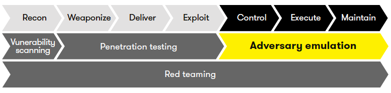
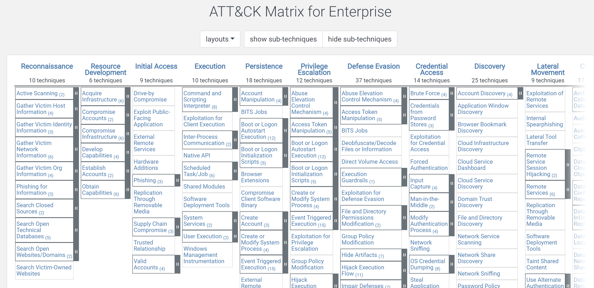

# Linux 威胁模拟工具设计与实现
## 摘要
## 一、绪论
在传统的网络攻防演练活动中，攻防演练双方要么在一个使用一个第三方搭建的仿真演练平台、要么直接在真实网络系统环境中展开一场模拟真实网络攻防活动的演练活动，这种演练方式的优点在于其高仿真性，缺点在于无法准确评估防御方的能力，因为对于防御方的能力检验仿真性程度高低很大程度上取决于攻击方的攻击能力高低。ATT&CK 知识库的出现使得对于特定威胁类型和手段的模拟有了标准化描述，这使得对于防御方的能力检验仿真性保证，从依赖于攻击方攻击能力水平转为依赖于标准化威胁模拟方案。只要基于标准化的方案开发不同的标准化模拟工具，就能逐渐摆脱目前网络攻防演练中缺少高水平攻击队的困境，使得防御方能在「高仿真水平」环境中完成防御能力训练和检验。

本毕业设计基于MITRE ATT&CK提出的对手仿真计划（Adversary Emulation Plans）,聚焦于面向Linux网络攻防演练活动中的威胁模拟工具设计与实现。本毕业设计在实验中搭建了贴合现实特定环境的靶场，该靶场由四台内置了ids的靶机组成，接着使用攻击方模拟工具，对靶场进行半自动化的模拟攻击，从而检测防御方的能力，并针对本次实验完成了基于ATT&CK的攻击路线图和攻击技术图。
### （一）课题研究的背景和意义
#### 1. 研究背景
网络安全技术发展至今，在网络攻防的过程中，攻击方手段不断推陈出新，攻击方式源源不断，攻击链也是千变万化，而防御方的环境部署却相对单一。因此，长期以来，网络安全都处于“易攻难守”的不平衡不对称局面。造成这种局面的原因在于：一是传统网络的确定性、静态性，使攻击者具备时间优势和空间优势，能够对目标系统的脆弱性进行反复的探测分析和渗透测试，进而找到突破途径；二是传统网络的相似性，使攻击者具备攻击成本优势，可以把同样的攻击手段应用于大量类似的目标。  
因此由于新型网络攻击技术手段不断涌现，网络防御方不得不重视自身防御技术的创新和提高，更需要注重自身防御能力的测评，进一步筑牢加固网络安全防御体系，防御方必须进行革命性的技术创新和发展。  
[网络动态防御技术发展概况研究](http://www.gjbmj.gov.cn/n1/2020/1211/c411145-31963758.html)
##### 1）防御方现实水平
传统的网络安全防御思想是基于防火墙技术、入侵检测系统、反病毒系统、身份认证技术和网络安全风险监测等技术来建立纵深型立体网络安全防御体系，从而能够保障网络系统免遭恶意入侵破坏，其技术主要针对堵塞和消除被保护网络系统中存在的脆弱性。  
目前大多数防御方的能力无法得到准确评估主要有两大原因：  
一是因为缺少攻击方的出现，因此大多数组织依然使用着传统的方法来对抗攻击，比如使用商业安全产品来组织网站和恶意软件，应用补丁来纠正已安装软件中的漏洞。但这些传统手段只能针对部分威胁有效，既不能组织先进的攻击，也不能预估对手渗透到网络中后的下一步行为。  
二是因为攻击方的攻击能力无法准确评估，为了显著提高网络防御能力，包括MITRE在内的组织已经采用了一种基于威胁的防御策略，来有助于网络威胁情报的收集和分析，从而形成威胁情报数据池，应用于动态地、主动地重构系统，进一步组织或降低网络攻击的影响。  
[THREAT-BASED DEFENSE](https://www.mitre.org/capabilities/cybersecurity/threat-based-defense)
##### 2）攻击方模拟工具
网络攻防技术发展至今，虽然攻击技术和手段层出不穷，但追其根本，在完整的攻击过程中，还是有很多攻击方式的重复性使用。攻击方模拟工具集成了许多攻击手段，是相对较新的IT安全技术，它可以自动发现组织网络防御中的漏洞，进行主动地、持续地、自动地渗透测试，甚至一些好的工具没还能推荐响应和修复手段或程序，并对这些响应和修复策略进行优先排序。
##### 3）Adversary Emulation Plan
MITRE公司提出使用ATT&CK来创建对手模拟计划（Adversary Emulation Plans），既可以促进攻击方更加积极地完成攻击，也能使得防御方有效地测试他们的网络防御能力。甚至，可以将ATT&CK应用到更大的工程项目中去，比如安全运营中心中、态势感知系统中等等，进一步有效地测试产品和环境的防御能力。  

[Adversary Emulation Plans](https://attack.mitre.org/resources/adversary-emulation-plans/)  
[Adversary emulation: Measure your ability to detect attackers](https://www.dxc.technology/security/insights/147214-adversary_emulation_measure_your_ability_to_detect_attackers)
##### 3）ATT&CK
2013年，MITRE公司发布了《ATT&CK框架》，该框架是在公共威胁情报和威胁报告的基础上，对对抗性妥协后活动进行了分类，因此，它是根据对攻击方攻击行为的归纳总结得出的经验，能够评估和衡量部署的安全控制的有效性，防止或检测敌对行为。分为针对企业IT网络和云的攻击防范（ATT&CK for Enterprise）和针对移动设备的攻击防范（ATT&CK for Mobile）。方便防御者分类攻击和进行风险评估。  
目前私人企业、政府以及网络安全产品和服务社区的特定威胁模型和方法都是以ATT&CK知识库为基础开发起来的具体或特定的威胁模型。其特点是半年更新一次，具有时效性，内容较为全面，支持多人共同贡献，免费开放。主要的使用场景为：入侵者模拟、红队、行为分析开发、防御性缺口评估、SOC成熟度评估、网络威胁情报丰富化。    

ATT&CK对于攻防双方均有益处。让红队的攻击更完善有效，甚至促进创新。让蓝队更了解攻击者，进一步评估当前控制防御系统的能力。主要有以下两大功能：  
评估：协助防御方更加结构化地检测控制威胁，比如明确威胁分析着手点，划分优先级，危害等级评估，以及确定相关检测技术等。  
强化：ATT&CK提供技术细节来促进攻防队伍采取更好的战术或技术，以及帮助防守方建立自动监控规则和全天候的威胁狩猎。  
ATT&CK是一个中层模型，不同于[Lockheed Martin Kill Chain](https://www.lockheedmartin.com/en-us/capabilities/cyber/cyber-kill-chain.html) 和Microsoft STRIDE等宏观的针对流程和目标的高级框架，也不同于Exploit等具体实例，其最大的特点是提供了非常详细和不断更新的技术信息，比如何种操作、操作之间的关系、操作序列。最大的优点就在于其具备上下文，通过这些上下文，我们可以清晰地可以溯源到攻击方，看到完整的攻击链，清晰整个攻击流程。  
[ATT&CK FAQ](https://attack.mitre.org/resources/faq/)
#### 2.研究意义

### （二）本课题研究的热点及发展现状
#### 1. 研究热点
#### 2. 发展现状
##### （1） 竞品调研（创新性说明）
##### （2） 行业影响（现实性说明）

## 二、靶场环境
### 1. 单靶机环境
* 备注：准备写单靶机中间件漏洞+CVE+IDS

### 2. 靶场网络环境
* 备注：准备写场景设计
## 三、攻击方仿真
### 攻击方模拟工具
* 备注：介绍本次实验中使用过的攻击方模拟工具
### 攻击方仿真

## 四、结果验证
### 基于Metasploit的半自动化攻击
### 攻击路线图和攻击技术图
## 五、研究总结
## 六、参考文献
